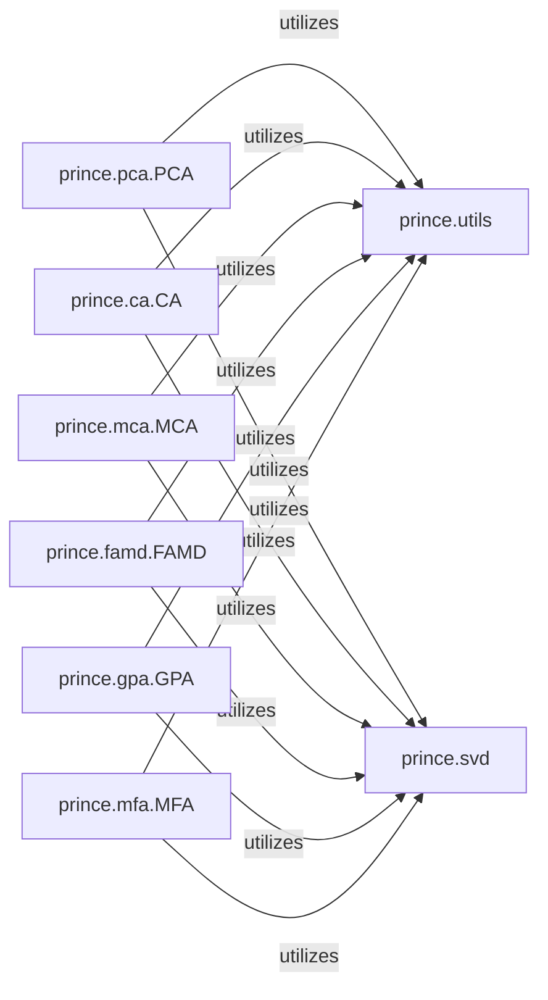

## Details

The `Multivariate Analysis Models` subsystem encompasses the core statistical models within the `prince` library. Its boundaries are defined by the modules implementing specific multivariate analysis techniques and their direct, shared dependencies.

### prince.pca.PCA
Implements the Principal Component Analysis (PCA) algorithm. It adheres to the scikit-learn API, providing `fit` and `transform` methods for dimensionality reduction and data projection.

**Related Classes/Methods**:

- <a href="https://github.com/MaxHalford/prince/blob/master/prince/pca.py#L27-L432" target="_blank" rel="noopener noreferrer">`prince.pca.PCA`:27-432</a>

### prince.ca.CA
Implements the Correspondence Analysis (CA) algorithm. It follows the scikit-learn API, offering `fit` and `transform` methods for analyzing relationships between categorical variables.

**Related Classes/Methods**:

- <a href="https://github.com/MaxHalford/prince/blob/master/prince/ca.py#L36-L365" target="_blank" rel="noopener noreferrer">`prince.ca.CA`:36-365</a>

### prince.mca.MCA
Implements the Multiple Correspondence Analysis (MCA) algorithm. It provides `fit` and `transform` methods consistent with the scikit-learn API for analyzing multiple categorical variables.

**Related Classes/Methods**:

- <a href="https://github.com/MaxHalford/prince/blob/master/prince/mca.py#L16-L150" target="_blank" rel="noopener noreferrer">`prince.mca.MCA`:16-150</a>

### prince.famd.FAMD
Implements the Factor Analysis of Mixed Data (FAMD) algorithm. It adheres to the scikit-learn API, enabling the analysis of datasets containing both quantitative and qualitative variables.

**Related Classes/Methods**:

- <a href="https://github.com/MaxHalford/prince/blob/master/prince/famd.py#L13-L147" target="_blank" rel="noopener noreferrer">`prince.famd.FAMD`:13-147</a>

### prince.gpa.GPA
Implements the Generalized Procrustes Analysis (GPA) algorithm. It provides `fit` and `transform` methods for aligning multiple configurations of data.

**Related Classes/Methods**:

- <a href="https://github.com/MaxHalford/prince/blob/master/prince/gpa.py#L14-L183" target="_blank" rel="noopener noreferrer">`prince.gpa.GPA`:14-183</a>

### prince.mfa.MFA
Implements the Multiple Factor Analysis (MFA) algorithm. It follows the scikit-learn API, designed for analyzing data structured into groups of variables.

**Related Classes/Methods**:

- <a href="https://github.com/MaxHalford/prince/blob/master/prince/mfa.py#L14-L268" target="_blank" rel="noopener noreferrer">`prince.mfa.MFA`:14-268</a>

### prince.utils
A utility component providing common statistical operations, data validation, and helper functions used across various multivariate analysis models. This includes functionalities like summarizing eigenvalues and potentially aiding in visualization preparation.

**Related Classes/Methods**:

- <a href="https://github.com/MaxHalford/prince/blob/master/prince/utils.py#L1-L9999" target="_blank" rel="noopener noreferrer">`prince.utils`:1-9999</a>

### prince.svd
A core linear algebra component responsible for performing Singular Value Decomposition (SVD). It provides the fundamental matrix factorization capabilities required by several multivariate analysis models for dimensionality reduction and component extraction.

**Related Classes/Methods**:

- <a href="https://github.com/MaxHalford/prince/blob/master/prince/svd.py#L1-L9999" target="_blank" rel="noopener noreferrer">`prince.svd`:1-9999</a>

### [FAQ](https://github.com/CodeBoarding/GeneratedOnBoardings/tree/main?tab=readme-ov-file#faq)