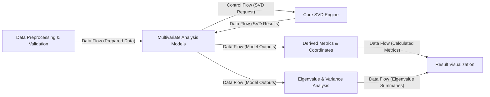

## Details

The prince project is structured as a robust Python library for multivariate exploratory data analysis, designed with a clear, sequential data processing pipeline. It begins with a dedicated Data Preprocessing & Validation stage to ensure data quality and readiness. This prepared data then feeds into the Multivariate Analysis Models, which encapsulate various statistical techniques. These models rely on a centralized Core SVD Engine for fundamental matrix decompositions. Post-computation, the analytical results are systematically processed by Derived Metrics & Coordinates and Eigenvalue & Variance Analysis components to extract meaningful insights. Finally, all analytical outputs converge at the Result Visualization component, providing comprehensive visual interpretations. This architecture emphasizes modularity, reusability of core computational logic, and a clear separation of concerns, making it highly suitable for both programmatic use and visual representation as a data flow diagram.

### Data Preprocessing & Validation
Responsible for initial data integrity checks, type conversions, and essential preprocessing steps like scaling and standardization, ensuring data is ready for analysis.

**Related Classes/Methods**:

- <a href="https://github.com/MaxHalford/prince/blob/master/prince/pca.py" target="_blank" rel="noopener noreferrer">`prince/pca.py`</a>
- <a href="https://github.com/MaxHalford/prince/blob/master/prince/utils.py" target="_blank" rel="noopener noreferrer">`prince/utils.py`</a>

### Core SVD Engine
The foundational component performing Singular Value Decomposition (SVD), a critical mathematical operation for many multivariate analysis techniques within prince.

**Related Classes/Methods**:

- <a href="https://github.com/MaxHalford/prince/blob/master/prince/svd.py" target="_blank" rel="noopener noreferrer">`prince/svd.py`</a>

### Multivariate Analysis Models [[Expand]](./Multivariate_Analysis_Models.md)
The central component housing various statistical models (e.g., PCA, CA, MCA, MFA, FAMD, GPA), each implementing a specific multivariate analysis method following the scikit-learn API.

**Related Classes/Methods**:

- <a href="https://github.com/MaxHalford/prince/blob/master/prince/pca.py" target="_blank" rel="noopener noreferrer">`prince/pca.py`</a>
- <a href="https://github.com/MaxHalford/prince/blob/master/prince/ca.py" target="_blank" rel="noopener noreferrer">`prince/ca.py`</a>
- <a href="https://github.com/MaxHalford/prince/blob/master/prince/mca.py" target="_blank" rel="noopener noreferrer">`prince/mca.py`</a>

### Derived Metrics & Coordinates [[Expand]](./Derived_Metrics_Coordinates.md)
Calculates various interpretative metrics such as row/column coordinates, contributions, and cosine similarities from the results of the fitted statistical models.

**Related Classes/Methods**:

- <a href="https://github.com/MaxHalford/prince/blob/master/prince/pca.py" target="_blank" rel="noopener noreferrer">`prince/pca.py`</a>

### Eigenvalue & Variance Analysis [[Expand]](./Eigenvalue_Variance_Analysis.md)
Extracts, summarizes, and provides insights into the eigenvalues and their corresponding explained variance from the statistical models, aiding in dimensionality understanding.

**Related Classes/Methods**:

- <a href="https://github.com/MaxHalford/prince/blob/master/prince/pca.py" target="_blank" rel="noopener noreferrer">`prince/pca.py`</a>
- <a href="https://github.com/MaxHalford/prince/blob/master/prince/utils.py" target="_blank" rel="noopener noreferrer">`prince/utils.py`</a>

### Result Visualization
Generates various plots (e.g., biplots, scree plots) to visually represent the results of the multivariate analyses, leveraging libraries like Altair for interactive displays.

**Related Classes/Methods**:

- <a href="https://github.com/MaxHalford/prince/blob/master/prince/pca.py" target="_blank" rel="noopener noreferrer">`prince/pca.py`</a>
- <a href="https://github.com/MaxHalford/prince/blob/master/prince/utils.py" target="_blank" rel="noopener noreferrer">`prince/utils.py`</a>

### [FAQ](https://github.com/CodeBoarding/GeneratedOnBoardings/tree/main?tab=readme-ov-file#faq)