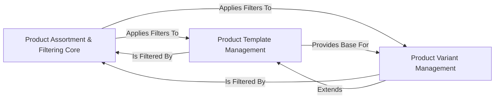

## Details

This subsystem focuses on defining and applying rules for product visibility and selection, leveraging Odoo's inherent data models and extensibility.

### Product Assortment & Filtering Core
This is the central component responsible for managing and applying dynamic filtering rules and product assortment logic. It utilizes Odoo's `ir.filters` model to allow users to define custom search and display criteria for products, enabling customer-specific views or dynamic filter applications.

**Related Classes/Methods**:

- `ir.filters` (1:1)

### Product Template Management
Manages the foundational data for generic products. This component defines the common attributes, categories, and sales information for a product before any specific variations are considered. It serves as the base for all product-related operations and is a primary target for assortment and filtering rules.

**Related Classes/Methods**:

- <a href="https://github.com/OCA/product-attribute/blob/18.0/product_code_unique/models/product.py#L1-L1" target="_blank" rel="noopener noreferrer">`product.template` (1:1)</a>

### Product Variant Management
Handles the specific, detailed variations of products, such as different sizes, colors, or configurations. This component extends the base product information from `Product Template Management` with variant-specific attributes and is also subject to the dynamic filtering and assortment rules.

**Related Classes/Methods**:

- `product.product`

### [FAQ](https://github.com/CodeBoarding/GeneratedOnBoardings/tree/main?tab=readme-ov-file#faq)