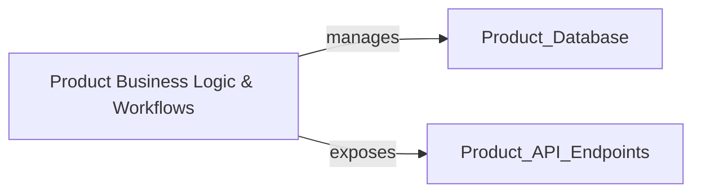

## Details

Refined analysis of the product management system, focusing on the interaction between business logic, API, and database components.

### Product Business Logic & Workflows
Core business logic and workflows related to product management, including product creation, updates, and lifecycle management.

**Related Classes/Methods**:

- `product_module.models.business_logic`

### [FAQ](https://github.com/CodeBoarding/GeneratedOnBoardings/tree/main?tab=readme-ov-file#faq)