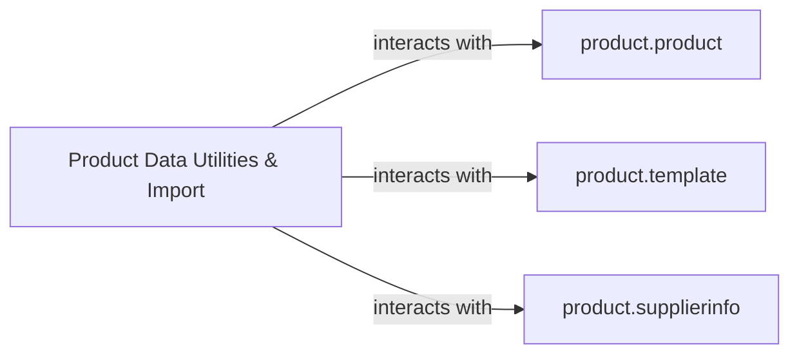

## Details

One paragraph explaining the functionality which is represented by this graph. What the main flow is and what is its purpose.

### Product Data Utilities & Import [[Expand]](./Product_Data_Utilities_Import.md)
This component is an Odoo wizard module designed to provide interactive user interfaces and backend logic for specific product data management tasks. Its core responsibilities include importing supplier information for products, managing product sets, and handling stock lot sequencing. This aligns with Odoo's "wizards" pattern for guided data operations and utility functions, facilitating complex data manipulations through a user-friendly interface.

**Related Classes/Methods**:

- <a href="https://github.com/OCA/product-attribute/blob/18.0/product_supplierinfo_import/wizards/product_supplierinfo_import.py" target="_blank" rel="noopener noreferrer">`product_supplierinfo_import.wizards.product_supplierinfo_import`</a>

### product.product
Represents individual product variants in the Odoo system. This component is responsible for storing and managing specific details of a product, such as its unique attributes, stock levels, and pricing for a particular variant. It interacts with other product-related components to provide detailed product information.

**Related Classes/Methods**: _None_

### product.template
Represents the generic product template in Odoo. This component defines the common attributes and characteristics shared by all variants of a product. It serves as a blueprint for creating individual `product.product` instances and is central to managing product families and their base properties.

**Related Classes/Methods**: _None_

### product.supplierinfo
Manages supplier-specific information for products. This component stores details such as supplier prices, lead times, and minimum order quantities for a given product. It is crucial for procurement and inventory management, linking products to their respective suppliers and their commercial terms.

**Related Classes/Methods**: _None_

### [FAQ](https://github.com/CodeBoarding/GeneratedOnBoardings/tree/main?tab=readme-ov-file#faq)