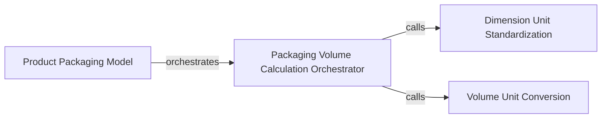

## Details

This subsystem focuses on defining, managing, and calculating various aspects of product packaging within the ERP system, adhering to Odoo's modular architecture.

### Product Packaging Model
The foundational data model responsible for defining and storing product packaging configurations. It serves as the primary interface for managing packaging dimensions, hierarchical levels, and initiating related calculations. This component is central as it represents the core business entity in Odoo's ORM.

**Related Classes/Methods**:

- <a href="https://github.com/OCA/product-attribute/blob/18.0/product_packaging_dimension/models/product_packaging.py#L5-L121" target="_blank" rel="noopener noreferrer">`ProductPackaging` (5:121)</a>

### Packaging Volume Calculation Orchestrator
This component orchestrates the overall volume calculation process for a product package. It acts as the primary entry point for the volume calculation business logic, coordinating calls to specific unit conversion utilities.

**Related Classes/Methods**:

- <a href="https://github.com/OCA/product-attribute/blob/18.0/product_packaging_dimension/models/product_packaging.py#L95-L105" target="_blank" rel="noopener noreferrer">`ProductPackaging:_calculate_volume` (95:105)</a>

### Dimension Unit Standardization
A utility component responsible for converting various dimension values (e.g., length, width, height) into a standardized unit (meters). This ensures consistency and accuracy for subsequent volume calculations.

**Related Classes/Methods**:

- <a href="https://github.com/OCA/product-attribute/blob/18.0/product_packaging_dimension/models/product_packaging.py#L107-L113" target="_blank" rel="noopener noreferrer">`ProductPackaging:convert_to_meters` (107:113)</a>

### Volume Unit Conversion
A utility component that converts the calculated volume into the appropriate unit of measurement (UoM) as defined by system or user preferences, ensuring the final volume is presented in the desired format.

**Related Classes/Methods**:

- <a href="https://github.com/OCA/product-attribute/blob/18.0/product_packaging_dimension/models/product_packaging.py#L115-L121" target="_blank" rel="noopener noreferrer">`ProductPackaging:convert_to_volume_uom` (115:121)</a>

### [FAQ](https://github.com/CodeBoarding/GeneratedOnBoardings/tree/main?tab=readme-ov-file#faq)