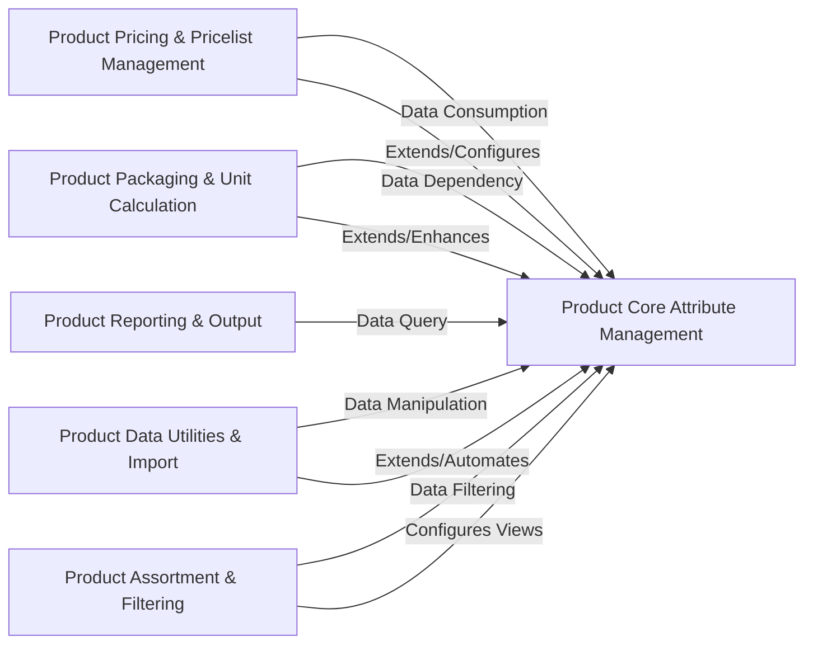

## Details

One paragraph explaining the functionality which is represented by this graph. What the main flow is and what is its purpose.

### Product Core Attribute Management [[Expand]](./Product_Core_Attribute_Management.md)
Centralizes and extends core Odoo product models (`product.template`, `product.product`, `product.category`) with specialized attributes and behaviors, including dimensions, states, UOM updatability, customer-specific information, barcode requirements, cost security, secondary units of measure, and category sequencing. It acts as the primary data source and foundational layer for product-related functionalities.

**Related Classes/Methods**:

- `product_dimension/models/product_template.py`

### Product Pricing & Pricelist Management
Manages the logic for product pricing, specifically focusing on how product list prices are derived and applied based on Odoo's pricelist and pricelist item configurations.

**Related Classes/Methods**:

- <a href="https://github.com/OCA/product-attribute/blob/18.0/product_pricelist_revision/models/pricelist.py#L1-L1" target="_blank" rel="noopener noreferrer">`product_pricelist_revision/models/pricelist.py` (1:1)</a>

### Product Packaging & Unit Calculation [[Expand]](./Product_Packaging_Unit_Calculation.md)
Handles the definition, management, and various calculations related to product packaging. This includes managing packaging dimensions, hierarchical packaging levels, and calculating unit prices based on specific packaging configurations.

**Related Classes/Methods**:

- `product_packaging_dimension/models/product_packaging.py`

### Product Reporting & Output
Provides functionalities for generating various reports and facilitating the printing of product-related information, such as pricetags.

**Related Classes/Methods**:

- <a href="https://github.com/OCA/product-attribute/blob/18.0/product_print_category/report/report_pricetag.py#L1-L1" target="_blank" rel="noopener noreferrer">`product_print_category/report/report_pricetag.py` (1:1)</a>

### Product Data Utilities & Import [[Expand]](./Product_Data_Utilities_Import.md)
Offers utility wizards for specific product data management tasks, including importing supplier information for products, managing product sets, and handling stock lot sequencing.

**Related Classes/Methods**:

- <a href="https://github.com/OCA/product-attribute/blob/18.0/product_supplierinfo_import/wizards/product_supplierinfo_import.py#L1-L1" target="_blank" rel="noopener noreferrer">`product_supplierinfo_import/wizards/product_supplierinfo_import.py` (1:1)</a>

### Product Assortment & Filtering [[Expand]](./Product_Assortment_Filtering.md)
Manages product assortment rules and provides advanced filtering capabilities, potentially involving customer-specific product views or dynamic filter applications.

**Related Classes/Methods**:

- `product_assortment/models/ir_filters.py`

### [FAQ](https://github.com/CodeBoarding/GeneratedOnBoardings/tree/main?tab=readme-ov-file#faq)