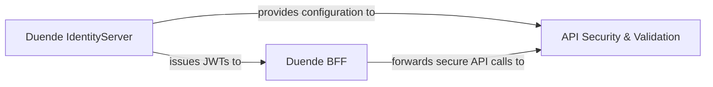

## Details

One paragraph explaining the functionality which is represented by this graph. What the main flow is and what is its purpose.

### Duende IdentityServer
This component serves as the central Security Token Service (STS) within the architecture. Its primary responsibility is to issue JSON Web Tokens (JWTs) and manage user identities, acting as the authoritative source for authentication and authorization. It implements OpenID Connect and OAuth 2.0 protocols, providing the necessary endpoints for clients to obtain security tokens.

**Related Classes/Methods**: _None_

### Duende BFF
The Backend for Frontend (BFF) component acts as a secure intermediary between frontend applications and backend APIs. Its main role is to handle the complexities of token acquisition and management on behalf of the frontend, mitigating common browser-based security risks like Cross-Site Scripting (XSS) and Cross-Site Request Forgery (CSRF). It securely forwards authenticated API requests to downstream services.

**Related Classes/Methods**: _None_

### API Security & Validation
This component is specifically designed for ASP.NET Core APIs to consume and validate JWTs. It integrates with the ASP.NET Core authentication middleware, providing services to verify the authenticity, integrity, and validity of incoming JWTs. This includes checking signatures, claims, and token expiry, ensuring that only legitimate and authorized requests are processed by the API. It primarily leverages the `Microsoft.AspNetCore.Authentication.JwtBearer` library.

**Related Classes/Methods**: _None_

### [FAQ](https://github.com/CodeBoarding/GeneratedOnBoardings/tree/main?tab=readme-ov-file#faq)