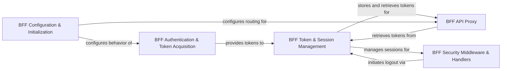

## Details

The Backend for Frontend Gateway (Duende BFF) subsystem, as a key part of a collection of security frameworks/libraries, is designed to provide a secure and robust gateway for client-side applications. Its architecture emphasizes strong module boundaries and clear API contracts to manage security concerns like token and session management, while acting as a protective proxy for backend APIs.

### BFF Authentication & Token Acquisition
This component is responsible for orchestrating the OpenID Connect authentication flow. It interacts directly with the Identity Provider (Duende IdentityServer) to securely obtain identity and access tokens on behalf of the client application.

**Related Classes/Methods**:

- `Duende.BFF.Authentication` (1:100)
- `Duende.BFF.OidcHandler` (1:100)

### BFF Token & Session Management
This component handles the secure, server-side storage, retrieval, and refreshing of access tokens, preventing their exposure to the client. It also manages the server-side session state, linking client sessions to these securely held tokens to maintain user context.

**Related Classes/Methods**:

- `Duende.BFF.TokenManagement` (1:100)
- `Duende.BFF.SessionManagement` (1:100)

### BFF API Proxy
Serving as the central operational component, the API Proxy intercepts all client-side requests destined for backend APIs. It retrieves and injects the appropriate access tokens (from the Token & Session Management component) into these requests before forwarding them to the designated backend services. It also handles the secure forwarding of responses back to the client.

**Related Classes/Methods**:

- `Duende.BFF.Proxy` (1:100)
- `Duende.BFF.Gateway` (1:100)

### BFF Security Middleware & Handlers
This component implements various cross-cutting security concerns within the BFF. This includes anti-forgery protection (e.g., CSRF tokens) to secure client-side applications, secure logout procedures to invalidate sessions and tokens, and potentially pre-forwarding token validation or introspection.

**Related Classes/Methods**:

- `Duende.BFF.Security` (1:100)
- `Duende.BFF.AntiForgery` (1:100)
- `Duende.BFF.Logout` (1:100)

### BFF Configuration & Initialization
This component is responsible for loading and applying all configuration settings for the Duende BFF. This includes defining IdentityServer endpoints, backend API routing rules, token lifetimes, and various security policies. It also manages the initial setup and bootstrapping of the BFF.

**Related Classes/Methods**:

- `Duende.BFF.Configuration` (1:100)
- `Duende.BFF.Startup` (1:100)

### [FAQ](https://github.com/CodeBoarding/GeneratedOnBoardings/tree/main?tab=readme-ov-file#faq)