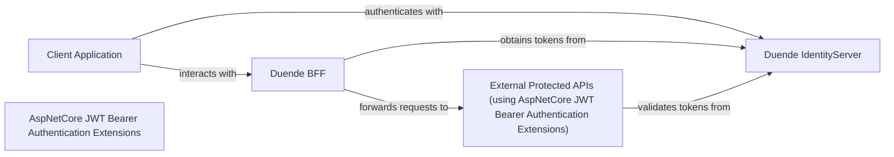

## Details

One paragraph explaining the functionality which is represented by this graph. What the main flow is and what is its purpose.

### Client Application [[Expand]](./Client_Application.md)
Represents a client-side application (e.g., JavaScript SPA) that consumes the security frameworks/libraries provided by this project. It initiates authentication flows with Duende IdentityServer and routes API calls through Duende BFF to access protected resources. This component is typically an example or demonstration of how to integrate with the project's offerings, rather than being a part of the core security frameworks/libraries themselves.

**Related Classes/Methods**: _None_

### Duende IdentityServer
The central OpenID Connect and OAuth 2.0 framework responsible for authenticating users and issuing security tokens. It acts as the Security Token Service (STS) for the entire ecosystem.

**Related Classes/Methods**: _None_

### Duende BFF
A specialized backend component designed to secure client-side applications (like SPAs) by acting as a secure proxy. It handles token management, session management, and protects against common web vulnerabilities (e.g., CSRF) by abstracting direct token handling from the client.

**Related Classes/Methods**: _None_

### AspNetCore JWT Bearer Authentication Extensions
A set of extensions and libraries for ASP.NET Core applications that enable the validation and processing of JWT bearer tokens. This component is used by protected APIs to authorize requests based on tokens issued by Duende IdentityServer.

**Related Classes/Methods**: _None_

### External Protected APIs (using AspNetCore JWT Bearer Authentication Extensions)
Represents external APIs that are protected and use the AspNetCore JWT Bearer Authentication Extensions for token validation.

**Related Classes/Methods**: _None_

### [FAQ](https://github.com/CodeBoarding/GeneratedOnBoardings/tree/main?tab=readme-ov-file#faq)