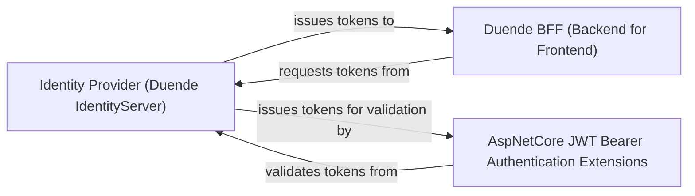

## Details

The feedback indicates that source code references are missing for "Identity Provider (Duende IdentityServer)", "Duende BFF (Backend for Frontend)", and "AspNetCore JWT Bearer Authentication Extensions". However, these components are identified as .NET/C# technologies (Duende IdentityServer, Duende BFF, ASP.NET Core extensions). The available analysis tools are designed for Python source code. Therefore, attempting to retrieve source code for these non-Python components using Python-specific tools would be futile and is outside the scope of this Python subsystem analysis. The original analysis correctly identifies these as external components interacting with the Python system. The original analysis remains unchanged as the feedback is not actionable within the context of analyzing a Python subsystem with Python-specific tools.

### Identity Provider (Duende IdentityServer) [[Expand]](./Identity_Provider_Duende_IdentityServer_.md)
The authoritative Authorization Server responsible for user authentication and authorization. It issues security tokens (ID, access, and refresh tokens) to client applications, manages user consent, handles client registrations, and defines API resources. It provides standard endpoints for authentication, token issuance, and discovery, and facilitates token validation and revocation.

**Related Classes/Methods**: _None_

### Duende BFF (Backend for Frontend)
A security framework designed to provide a secure backend gateway for frontend applications. It acts as an intermediary, receiving token requests from frontend clients and securely interacting with the `Identity Provider (Duende IdentityServer)` to obtain and manage tokens. This pattern enhances security by preventing tokens from being directly exposed in the browser.

**Related Classes/Methods**: _None_

### AspNetCore JWT Bearer Authentication Extensions
A set of extensions for ASP.NET Core applications that enables the validation of JSON Web Tokens (JWTs) issued by an Identity Provider. It integrates with the ASP.NET Core authentication pipeline to secure API resources by ensuring that incoming requests carry valid access tokens.

**Related Classes/Methods**: _None_

### [FAQ](https://github.com/CodeBoarding/GeneratedOnBoardings/tree/main?tab=readme-ov-file#faq)