```mermaid
graph LR
    Identity_Provider_Duende_IdentityServer_["Identity Provider (Duende IdentityServer)"]
    Backend_for_Frontend_Gateway_Duende_BFF_["Backend for Frontend Gateway (Duende BFF)"]
    API_Security_Validation_AspNetCore_JWT_Bearer_Authentication_Extensions_["API Security & Validation (AspNetCore JWT Bearer Authentication Extensions)"]
    Client_Application["Client Application"]
    Client_Application -- "initiates authentication with" --> Identity_Provider_Duende_IdentityServer_
    Identity_Provider_Duende_IdentityServer_ -- "redirects back to" --> Client_Application
    Client_Application -- "communicates with" --> Backend_for_Frontend_Gateway_Duende_BFF_
    Backend_for_Frontend_Gateway_Duende_BFF_ -- "serves" --> Client_Application
    Backend_for_Frontend_Gateway_Duende_BFF_ -- "initiates authentication with" --> Identity_Provider_Duende_IdentityServer_
    Identity_Provider_Duende_IdentityServer_ -- "issues tokens to" --> Backend_for_Frontend_Gateway_Duende_BFF_
    Backend_for_Frontend_Gateway_Duende_BFF_ -- "forwards tokens to" --> API_Security_Validation_AspNetCore_JWT_Bearer_Authentication_Extensions_
    API_Security_Validation_AspNetCore_JWT_Bearer_Authentication_Extensions_ -- "validates tokens from" --> Backend_for_Frontend_Gateway_Duende_BFF_
    API_Security_Validation_AspNetCore_JWT_Bearer_Authentication_Extensions_ -- "trusts as the token issuer" --> Identity_Provider_Duende_IdentityServer_
    click Identity_Provider_Duende_IdentityServer_ href "https://github.com/CodeBoarding/GeneratedOnBoardings/blob/main/products/Identity_Provider_Duende_IdentityServer_.md" "Details"
    click Backend_for_Frontend_Gateway_Duende_BFF_ href "https://github.com/CodeBoarding/GeneratedOnBoardings/blob/main/products/Backend_for_Frontend_Gateway_Duende_BFF_.md" "Details"
    click API_Security_Validation_AspNetCore_JWT_Bearer_Authentication_Extensions_ href "https://github.com/CodeBoarding/GeneratedOnBoardings/blob/main/products/API_Security_Validation_AspNetCore_JWT_Bearer_Authentication_Extensions_.md" "Details"
    click Client_Application href "https://github.com/CodeBoarding/GeneratedOnBoardings/blob/main/products/Client_Application.md" "Details"
```

## Details

The feedback indicates a lack of source file references for the identified components. However, the components listed (Duende IdentityServer, Duende BFF, AspNetCore JWT Bearer Authentication Extensions, and Client Application) are described as external systems, frameworks, or conceptual client-side applications, not as Python modules within the project's codebase. Therefore, it is not possible to provide source code references for these components using `getPythonSourceCode` or `readFile` as they are not part of the Python project being analyzed. My analysis focuses on the architectural interactions and responsibilities of these components within the system, treating them as black boxes or external dependencies. The original analysis accurately reflects the high-level architectural abstraction and the nature of these components. No changes to the architectural analysis are required based on this feedback.

### Identity Provider (Duende IdentityServer) [[Expand]](./Identity_Provider_Duende_IdentityServer_.md)
Central authority for user authentication and authorization, implementing OpenID Connect and OAuth 2.0. It issues security tokens (ID and access tokens) to client applications and manages user consent, client registrations, and API resources.

**Related Classes/Methods**: _None_

### Backend for Frontend Gateway (Duende BFF) [[Expand]](./Backend_for_Frontend_Gateway_Duende_BFF_.md)
Provides a secure and robust gateway for client-side applications to interact with backend APIs. It handles critical security concerns such as token management (securely storing access tokens server-side), session management, and acts as a proxy to protect backend APIs.

**Related Classes/Methods**: _None_

### API Security & Validation (AspNetCore JWT Bearer Authentication Extensions) [[Expand]](./API_Security_Validation_AspNetCore_JWT_Bearer_Authentication_Extensions_.md)
Enables ASP.NET Core APIs to securely consume and validate JSON Web Tokens (JWTs) issued by an Identity Provider. This component provides middleware and services to authenticate incoming API requests by verifying JWT signatures, claims, and expiry.

**Related Classes/Methods**: _None_

### Client Application [[Expand]](./Client_Application.md)
Represents a client-side application (e.g., JavaScript SPA) that interacts with the security ecosystem to authenticate users and access protected APIs.

**Related Classes/Methods**: _None_

### [FAQ](https://github.com/CodeBoarding/GeneratedOnBoardings/tree/main?tab=readme-ov-file#faq)