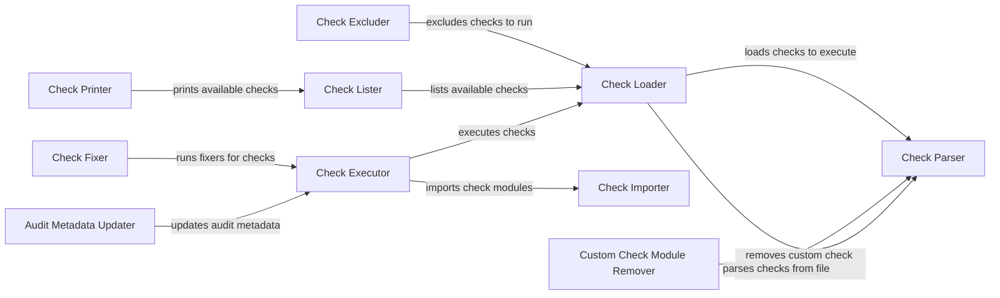

## Component Details

### Check Loader
The Check Loader is responsible for discovering and loading security checks from various sources. It dynamically imports check modules, manages their metadata, and prepares them for execution. This component ensures that all checks are available and ready to be executed in a controlled and consistent manner.
- **Related Classes/Methods**: `prowler.lib.check.checks_loader:load_checks_to_execute`, `prowler.lib.check.checks_loader:update_checks_to_execute_with_aliases`

### Check Excluder
The Check Excluder component provides functionalities to exclude checks from the execution list based on various criteria such as check names, service names, and compliance requirements. It ensures that only the relevant checks are executed, reducing unnecessary overhead and focusing on the specific security concerns.
- **Related Classes/Methods**: `prowler.lib.check.check:exclude_checks_to_run`, `prowler.lib.check.check:exclude_services_to_run`

### Check Parser
The Check Parser component handles the parsing of check definitions from files and folders. It supports JSON files containing lists of checks and allows importing custom checks by moving check folders to the corresponding service directories. This component enables the dynamic addition and management of checks from external sources.
- **Related Classes/Methods**: `prowler.lib.check.check:parse_checks_from_file`, `prowler.lib.check.check:parse_checks_from_folder`

### Check Lister
The Check Lister component provides functionalities to list available services, fixers, categories, and compliance frameworks. It recovers checks from the provider and extracts relevant information to provide a comprehensive overview of the available security checks and related resources.
- **Related Classes/Methods**: `prowler.lib.check.check:list_services`, `prowler.lib.check.check:list_fixers`, `prowler.lib.check.check:list_categories`

### Check Printer
The Check Printer component is responsible for printing information about available checks, services, fixers, categories, and compliance frameworks to the console. It provides a user-friendly interface for exploring the available security checks and their associated metadata.
- **Related Classes/Methods**: `prowler.lib.check.check:print_categories`, `prowler.lib.check.check:print_services`, `prowler.lib.check.check:print_fixers`, `prowler.lib.check.check:print_compliance_frameworks`, `prowler.lib.check.check:print_compliance_requirements`, `prowler.lib.check.check:print_checks`

### Check Importer
The Check Importer component handles the dynamic importing of check modules using their paths. It allows the system to load and execute checks from various locations, enabling flexibility and extensibility in the check execution process.
- **Related Classes/Methods**: `prowler.lib.check.check:import_check`

### Check Fixer
The Check Fixer component is responsible for running fixers associated with checks when findings indicate a failure. It imports the fixer module and executes it to remediate the identified security issues. This component automates the process of resolving security vulnerabilities.
- **Related Classes/Methods**: `prowler.lib.check.check:run_fixer`

### Check Executor
The Check Executor component orchestrates the execution of individual checks. It imports check modules, recovers functions from the check, and executes the check. This component is the core of the check execution framework, ensuring that all checks are executed in a controlled and consistent manner.
- **Related Classes/Methods**: `prowler.lib.check.check:execute_checks`, `prowler.lib.check.check:execute`

### Audit Metadata Updater
The Audit Metadata Updater component updates the audit metadata with the new status after executing a check. This component ensures that the audit trail accurately reflects the results of the check execution, providing valuable information for security monitoring and compliance reporting.
- **Related Classes/Methods**: `prowler.lib.check.check:update_audit_metadata`

### Custom Check Module Remover
The Custom Check Module Remover component removes custom check modules from the prowler directory. This component is responsible for cleaning up custom checks.
- **Related Classes/Methods**: `prowler.lib.check.check:remove_custom_checks_module`
