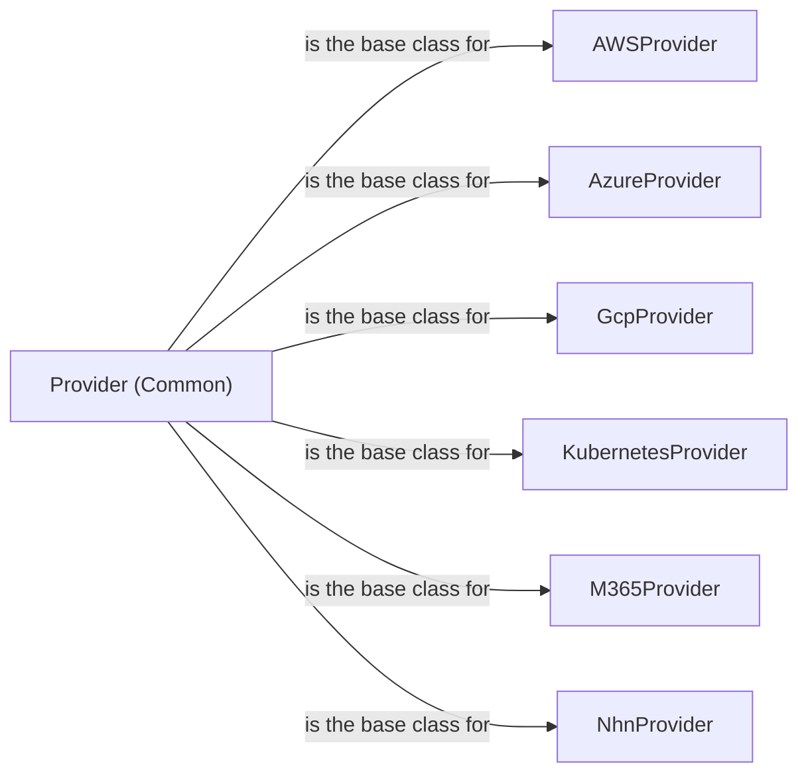

## Component Details

### Provider (Common)
Abstract base class for all cloud providers. It defines the structure and common functionalities for interacting with different cloud services. This includes session management, configuration loading, mutelist handling, and defining abstract methods that each specific provider must implement.
- **Related Classes/Methods**: `prowler.providers.common.provider.Provider`

### AWSProvider
The AWS provider implementation, extending the base Provider class. It handles AWS-specific session setup using boto3, credential validation, region discovery, and enumeration of AWS Organizations and accounts. It provides concrete implementations for interacting with AWS APIs.
- **Related Classes/Methods**: `prowler.providers.aws.aws_provider.AwsProvider`

### AzureProvider
The Azure provider implementation, extending the base Provider class. It manages Azure-specific session setup using the Azure SDK, credential validation, region discovery, and subscription enumeration. It provides concrete implementations for interacting with Azure APIs.
- **Related Classes/Methods**: `prowler.providers.azure.azure_provider.AzureProvider`

### GcpProvider
The GCP provider implementation, extending the base Provider class. It handles GCP-specific session setup using the Google Cloud Client Library, credential validation, project discovery, and organization enumeration. It provides concrete implementations for interacting with GCP APIs.
- **Related Classes/Methods**: `prowler.providers.gcp.gcp_provider.GcpProvider`

### KubernetesProvider
The Kubernetes provider implementation, extending the base Provider class. It manages Kubernetes-specific session setup using the Kubernetes client, credential validation, and namespace enumeration. It provides concrete implementations for interacting with Kubernetes APIs.
- **Related Classes/Methods**: `prowler.providers.kubernetes.kubernetes_provider.KubernetesProvider`

### M365Provider
The M365 provider implementation, extending the base Provider class. It handles M365-specific session setup, credential validation, and PowerShell setup. It uses the Microsoft Graph API and PowerShell to interact with M365 services.
- **Related Classes/Methods**: `prowler.providers.m365.m365_provider.M365Provider`

### NhnProvider
The NHN provider implementation, extending the base Provider class. It handles NHN-specific session setup and credential validation. It uses the NHN SDK to interact with NHN APIs.
- **Related Classes/Methods**: `prowler.providers.nhn.nhn_provider.NhnProvider`
