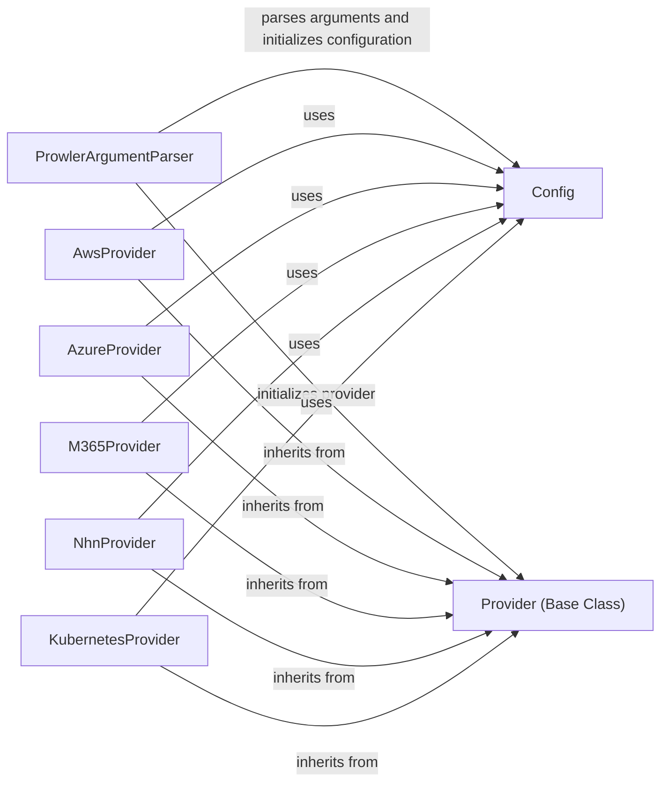

## Component Details

### ProwlerArgumentParser
Parses command-line arguments for Prowler, defining available options and their behavior. It uses `argparse` to handle argument parsing and sets default providers based on the arguments provided. It is the entry point for configuring Prowler's behavior.
- **Related Classes/Methods**: `prowler.lib.cli.parser.ProwlerArgumentParser`

### Config
The Config class is responsible for managing Prowler's configuration settings. It handles loading, validating, and providing access to configuration values from various sources, such as command-line arguments and configuration files. It centralizes configuration management.
- **Related Classes/Methods**: `prowler.config.config.Config`

### Provider (Base Class)
Base class for all providers (AWS, Azure, GCP, etc.). It initializes the global provider and sets up the necessary configurations to interact with cloud services. It serves as an abstract base for cloud provider configurations.
- **Related Classes/Methods**: `prowler.config.config.Provider`

### AwsProvider
Initializes the AWS provider, setting up the necessary credentials and configurations to interact with AWS services. It inherits from the Provider base class and configures AWS-specific settings.
- **Related Classes/Methods**: `prowler.providers.aws.aws_provider.AwsProvider`

### AzureProvider
Initializes the Azure provider, setting up the necessary credentials and configurations to interact with Azure services. It inherits from the Provider base class and configures Azure-specific settings.
- **Related Classes/Methods**: `prowler.providers.azure.azure_provider.AzureProvider`

### M365Provider
Initializes the M365 provider, setting up the necessary credentials and configurations to interact with M365 services. It inherits from the Provider base class and configures M365-specific settings.
- **Related Classes/Methods**: `prowler.providers.m365.m365_provider.M365Provider`

### NhnProvider
Initializes the NHN provider, setting up the necessary credentials and configurations to interact with NHN services. It inherits from the Provider base class and configures NHN-specific settings.
- **Related Classes/Methods**: `prowler.providers.nhn.nhn_provider.NhnProvider`

### KubernetesProvider
Initializes the Kubernetes provider, setting up the necessary credentials and configurations to interact with Kubernetes clusters. It inherits from the Provider base class and configures Kubernetes-specific settings.
- **Related Classes/Methods**: `prowler.providers.kubernetes.kubernetes_provider.KubernetesProvider`
