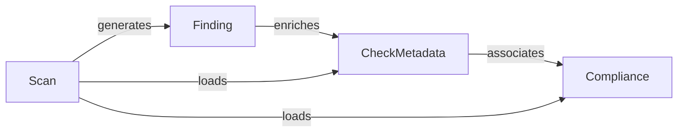

## Component Details

### Finding
Represents a security finding, encapsulating details such as its ID, status, resource information, and compliance status. It serves as the primary data structure for representing scan results and is used by other components to generate outputs and reports.
- **Related Classes/Methods**: `prowler.lib.outputs.finding.Finding`

### CheckMetadata
Manages metadata associated with security checks, including the check's ID, title, description, and related compliance requirements. It provides a structured way to access check-related information and is used by the Checks Loader and Check Execution components to configure and execute checks.
- **Related Classes/Methods**: `prowler.lib.check.models.CheckMetadata`, `prowler.lib.check.models.load_check_metadata`

### Compliance
Defines the structure for compliance frameworks and requirements, including standards, controls, and their mappings to security checks. It allows the system to associate checks with specific compliance requirements and is used by the Compliance Update component to enrich check metadata with compliance information.
- **Related Classes/Methods**: `prowler.lib.check.compliance_models.Compliance`, `prowler.lib.check.compliance_models.load_compliance_framework`

### Scan
Orchestrates the security scanning process, managing the loading of checks, their execution, and the generation of findings. It acts as the central coordinator for the scanning workflow and interacts with CheckMetadata, Compliance, and Check Execution to perform the scan.
- **Related Classes/Methods**: `prowler.lib.scan.scan.Scan`
