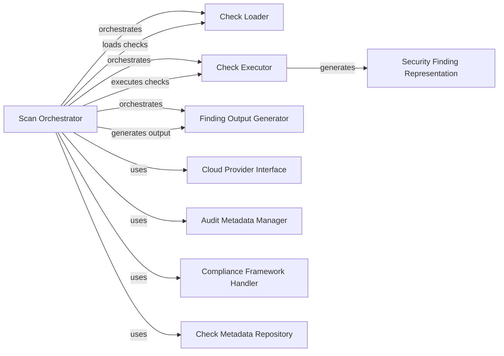

## Component Details

### Scan Orchestrator
The Scan orchestrator is the central component responsible for managing the entire audit process. It initializes the audit, loads and filters checks based on provided arguments, executes these checks, and manages the generation of findings. It coordinates the interactions between other components, ensuring a smooth and efficient workflow.
- **Related Classes/Methods**: `prowler.lib.scan.scan.Scan`

### Check Loader
The Check Loader component is responsible for loading and filtering the checks to be executed based on the provided arguments such as compliance frameworks, categories, and severities. It determines the specific checks that will be part of the scan.
- **Related Classes/Methods**: `prowler.lib.check.checks_loader.load_checks_to_execute`

### Check Executor
The Check Executor component executes the loaded checks. It imports and runs each check, capturing the findings and updating the audit metadata. It is responsible for the actual execution of the security assessments.
- **Related Classes/Methods**: `prowler.lib.check.check.execute`

### Finding Output Generator
The Finding Output Generator component generates the final output/report of the scan. It transforms the raw findings into a structured format suitable for reporting and analysis. It is the last step in the audit process, producing the deliverable results.
- **Related Classes/Methods**: `prowler.lib.outputs.finding.Finding.generate_output`

### Cloud Provider Interface
The Cloud Provider Interface component is responsible for initializing and managing the cloud provider (e.g., AWS, Azure, GCP) being audited. It provides access to the necessary APIs and configurations for the scan.
- **Related Classes/Methods**: `prowler.providers.common.provider.Provider`

### Audit Metadata Manager
The Audit Metadata Manager component represents the metadata associated with the audit process, such as the start time, duration, and number of checks executed. It provides context and information about the scan itself.
- **Related Classes/Methods**: `prowler.providers.common.models.Audit_Metadata`

### Compliance Framework Handler
The Compliance Framework Handler component handles the loading and management of compliance framework data. It retrieves compliance requirements and maps them to specific checks, ensuring that the audit aligns with relevant standards.
- **Related Classes/Methods**: `prowler.lib.check.compliance_models.Compliance`

### Check Metadata Repository
The Check Metadata Repository component stores metadata about each check, such as its ID, title, description, and risk level. It provides information about the purpose and characteristics of each security assessment.
- **Related Classes/Methods**: `prowler.lib.check.models.CheckMetadata`

### Security Finding Representation
The Security Finding Representation component represents a single security finding identified during the scan. It contains information about the affected resource, the severity of the issue, and the recommended remediation steps.
- **Related Classes/Methods**: `prowler.lib.outputs.finding.Finding`
