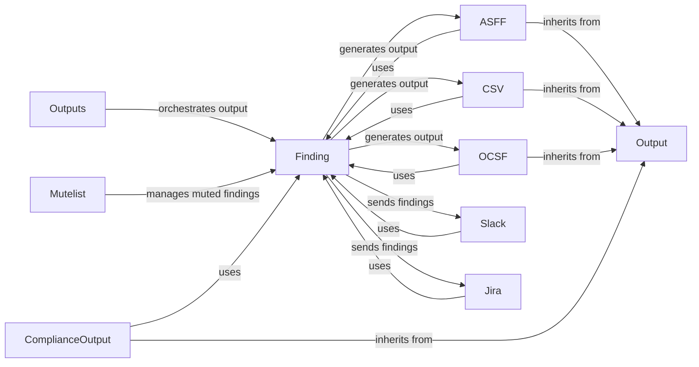

## Component Details

### Finding
Represents a security finding and is responsible for generating the output of a single finding in various formats. It encapsulates the details of a security issue, including its ID, status, severity, and any relevant metadata. The `Finding` class provides methods for formatting the finding data into different output formats, such as ASFF, CSV, and HTML.
- **Related Classes/Methods**: `prowler.lib.outputs.finding.Finding`

### Output
Abstract base class for all output formats. It defines the interface for writing findings to different outputs, such as files or external services. The `Output` class provides methods for creating file descriptors, transforming data, and writing the output. Specific output format classes, such as `ASFF`, `CSV`, and `Slack`, inherit from this class and implement the abstract methods.
- **Related Classes/Methods**: `prowler.lib.outputs.output.Output`

### ASFF
Handles the output of findings in the AWS Security Finding Format (ASFF). It transforms the finding data into the ASFF format, which is a standardized format for security findings in AWS. The `ASFF` class inherits from the `Output` class and implements the methods for formatting the finding data into ASFF.
- **Related Classes/Methods**: `prowler.lib.outputs.asff.asff.ASFF`

### CSV
Handles the output of findings in CSV format. It writes the finding data to a CSV file, which can be easily imported into spreadsheets or other data analysis tools. The `CSV` class inherits from the `Output` class and implements the methods for formatting the finding data into CSV.
- **Related Classes/Methods**: `prowler.lib.outputs.csv.csv.CSV`

### OCSF
Handles the output of findings in the Open Cybersecurity Schema Framework (OCSF) format. It transforms the finding data into the OCSF format, which is a standardized format for security findings. The `OCSF` class inherits from the `Output` class and implements the methods for formatting the finding data into OCSF.
- **Related Classes/Methods**: `prowler.lib.outputs.ocsf.ocsf.OCSF`

### Slack
Handles sending findings to a Slack channel. It formats the findings into Slack message blocks and sends them via the Slack API. The `Slack` class provides methods for authenticating with the Slack API, formatting the finding data into Slack message blocks, and sending the messages to the specified channel.
- **Related Classes/Methods**: `prowler.lib.outputs.slack.slack.Slack`

### ComplianceOutput
Base class for compliance output formats. It handles the creation of file descriptors and transformation of data for compliance reports. Specific compliance output format classes, such as `AWSMitreAttack`, `AzureMitreAttack`, and `GCPMitreAttack`, inherit from this class and implement the abstract methods.
- **Related Classes/Methods**: `prowler.lib.outputs.compliance.compliance_output.ComplianceOutput`

### Jira
Handles sending findings to Jira. It authenticates with Jira and creates issues for each finding. The `Jira` class provides methods for authenticating with the Jira API, formatting the finding data into Jira issues, and creating the issues in the specified project.
- **Related Classes/Methods**: `prowler.lib.outputs.jira.jira.Jira`

### Outputs
Orchestrates the output of findings in various formats. It receives findings and output options, and then calls the appropriate output format classes to generate the output. The `Outputs` class acts as a central point for managing the output process and ensuring that findings are delivered in the desired formats.
- **Related Classes/Methods**: `prowler.lib.outputs.outputs.Outputs`

### Mutelist
Manages a list of muted findings. It allows findings to be muted based on various criteria, such as resource ID or check ID. The `Mutelist` class provides methods for adding findings to the mutelist, checking if a finding is muted, and removing findings from the mutelist.
- **Related Classes/Methods**: `prowler.lib.mutelist.mutelist.Mutelist`
