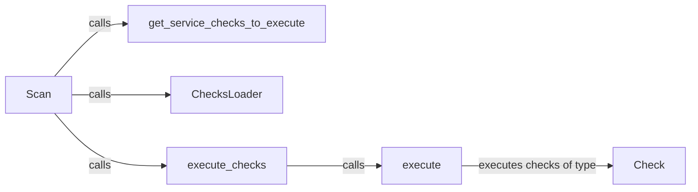

## Component Details

The Security Check Engine orchestrates the process of discovering, loading, and executing security checks within Prowler. It begins with the `Scan` component, which initiates the scan and delegates the loading of checks to the `ChecksLoader`. The `ChecksLoader` discovers and parses check definitions from the filesystem. The `Scan` component then determines which checks to execute using `get_service_checks_to_execute` and subsequently executes them via the `execute_checks` component. Each check is individually executed by the `execute` component, which contains the specific assessment logic. The engine leverages the `Check` class to represent individual security checks, defining their structure and execution methods. This entire process allows Prowler to systematically assess the security posture of a cloud environment.

### Scan
The Scan component initiates the security scan process. It orchestrates the loading and execution of security checks by delegating tasks to other components such as ChecksLoader and execute_checks.
- **Related Classes/Methods**: `prowler.lib.scan.scan.Scan:scan`, `prowler.lib.scan.scan`

### get_service_checks_to_execute
This component determines the specific service checks that should be executed based on the target environment or configuration. It filters the available checks to identify those relevant to the current scan.
- **Related Classes/Methods**: `prowler.lib.scan.scan:get_service_checks_to_execute`

### ChecksLoader
The ChecksLoader component is responsible for discovering and loading security checks from the filesystem. It parses check metadata and prepares the checks for execution by the scan engine.
- **Related Classes/Methods**: `prowler.lib.check.checks_loader`

### execute_checks
This component iterates through the loaded checks and calls the `execute` method for each check. It manages the execution of multiple checks in a systematic manner.
- **Related Classes/Methods**: `prowler.lib.check.check:execute_checks`

### execute
The execute component is responsible for executing a single security check. It contains the specific assessment logic for that check and generates the results.
- **Related Classes/Methods**: `prowler.lib.check.check:execute`

### Check
The Check component represents a single security check. It defines the structure and methods for executing a check and storing its results. It serves as a template for individual checks.
- **Related Classes/Methods**: `prowler.lib.check.check`
