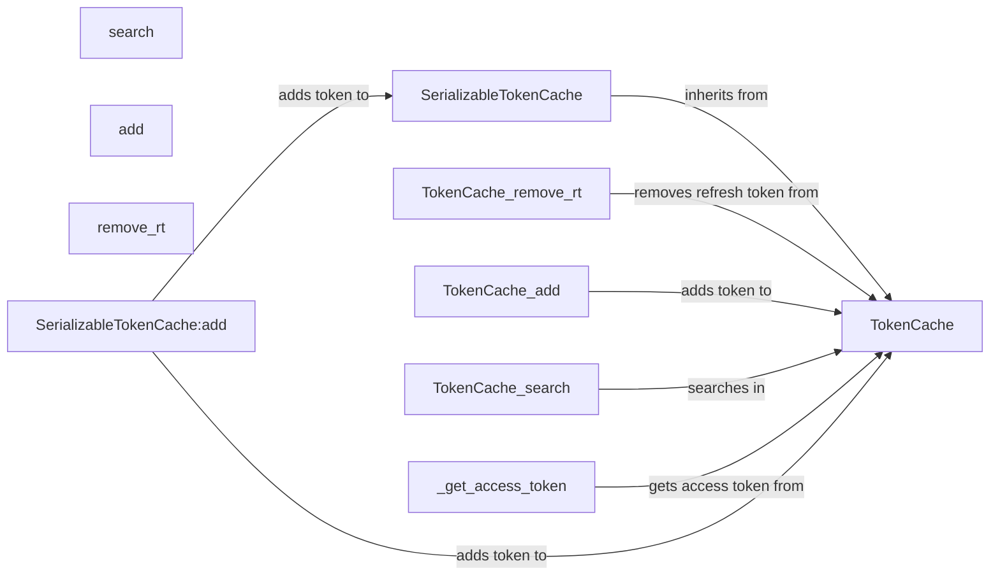

## Component Details

The Token Management System is responsible for securely storing, retrieving, and managing tokens used for authentication and authorization. It provides functionalities for searching, adding, removing, and updating tokens in a cache. The system also handles serialization and deserialization of the cache for persistence, ensuring tokens are available across application sessions and minimizing repeated authentication. The core of the system revolves around the `TokenCache` and `SerializableTokenCache` classes, which provide the necessary methods for token manipulation and persistence.

### TokenCache
The TokenCache class is the central component for managing tokens in memory. It provides methods for adding, searching, and removing tokens, as well as parsing account information. It acts as an in-memory store for tokens, providing fast access to cached credentials.
- **Related Classes/Methods**: `microsoft-authentication-library-for-python.msal.token_cache.TokenCache`

### _get_access_token
This method retrieves an access token from the cache based on the provided parameters. It searches the cache for a matching access token and returns it if found. It is a key method for retrieving cached tokens for authentication.
- **Related Classes/Methods**: `microsoft-authentication-library-for-python.msal.token_cache.TokenCache:_get_access_token`

### search
The search method allows searching the token cache for tokens matching specific criteria. It provides a flexible way to find tokens based on various parameters, such as account, environment, and scopes.
- **Related Classes/Methods**: `microsoft-authentication-library-for-python.msal.token_cache.TokenCache:search`

### add
The add method is used to add new tokens to the cache. It takes a token and its associated metadata as input and stores it in the cache for future use. This method is crucial for persisting newly acquired tokens.
- **Related Classes/Methods**: `microsoft-authentication-library-for-python.msal.token_cache.TokenCache:add`

### remove_rt
This method removes a refresh token from the cache. It is used to invalidate a refresh token, typically when an account is removed or a token is revoked.
- **Related Classes/Methods**: `microsoft-authentication-library-for-python.msal.token_cache.TokenCache:remove_rt`

### SerializableTokenCache
The SerializableTokenCache class extends the TokenCache to provide serialization capabilities. It allows the cache to be saved to a persistent storage and loaded back into memory, ensuring that tokens are available across application sessions.
- **Related Classes/Methods**: `microsoft-authentication-library-for-python.msal.token_cache.SerializableTokenCache`

### SerializableTokenCache:add
This method overrides the add method of the base TokenCache class to include serialization logic. When a token is added to the cache, it is also serialized and saved to persistent storage.
- **Related Classes/Methods**: `microsoft-authentication-library-for-python.msal.token_cache.SerializableTokenCache:add`
