```mermaid
graph LR
    Orchestration_Engine["Orchestration Engine"]
    Configuration_Management["Configuration Management"]
    Check_Execution_Framework["Check Execution Framework"]
    Cloud_Provider_Abstraction["Cloud Provider Abstraction"]
    Reporting_and_Output_Management["Reporting and Output Management"]
    Data_Modeling["Data Modeling"]
    Orchestration_Engine -- "Orchestrates" --> Configuration_Management
    Orchestration_Engine -- "Orchestrates" --> Check_Execution_Framework
    Orchestration_Engine -- "Orchestrates" --> Reporting_and_Output_Management
    Configuration_Management -- "Provides configuration to" --> Check_Execution_Framework
    Check_Execution_Framework -- "Executes checks using" --> Cloud_Provider_Abstraction
    Check_Execution_Framework -- "Uses data models from" --> Data_Modeling
    Check_Execution_Framework -- "Generates output using" --> Reporting_and_Output_Management
    Cloud_Provider_Abstraction -- "Provides cloud resources to" --> Check_Execution_Framework
    Reporting_and_Output_Management -- "Uses data models from" --> Data_Modeling
    Data_Modeling -- "Defines data structures for" --> Check_Execution_Framework
    Data_Modeling -- "Defines data structures for" --> Reporting_and_Output_Management
    click Orchestration_Engine href "https://github.com/CodeBoarding/GeneratedOnBoardings/blob/main/prowler/Orchestration Engine.md" "Details"
    click Configuration_Management href "https://github.com/CodeBoarding/GeneratedOnBoardings/blob/main/prowler/Configuration Management.md" "Details"
    click Check_Execution_Framework href "https://github.com/CodeBoarding/GeneratedOnBoardings/blob/main/prowler/Check Execution Framework.md" "Details"
    click Cloud_Provider_Abstraction href "https://github.com/CodeBoarding/GeneratedOnBoardings/blob/main/prowler/Cloud Provider Abstraction.md" "Details"
    click Reporting_and_Output_Management href "https://github.com/CodeBoarding/GeneratedOnBoardings/blob/main/prowler/Reporting and Output Management.md" "Details"
    click Data_Modeling href "https://github.com/CodeBoarding/GeneratedOnBoardings/blob/main/prowler/Data Modeling.md" "Details"
```

## Component Details

### Orchestration Engine
The Orchestration Engine serves as the central control point, managing the entire audit process from initialization to result generation. It coordinates the interactions between other components, ensuring a smooth and efficient workflow. This includes loading configurations, initiating checks, and managing the output of findings.
- **Related Classes/Methods**: `prowler.__main__`, `prowler.lib.scan.scan`

### Configuration Management
This component is responsible for loading, validating, and managing Prowler's configuration settings. It handles the retrieval of configuration values from various sources, such as command-line arguments and configuration files, providing a centralized and consistent way to access and manage these settings.
- **Related Classes/Methods**: `prowler.config.config`, `prowler.lib.cli.parser`

### Check Execution Framework
The Check Execution Framework focuses on discovering, loading, and executing security checks. It dynamically imports check modules, manages their metadata, and orchestrates their execution against the target environment. This component ensures that all checks are executed in a controlled and consistent manner.
- **Related Classes/Methods**: `prowler.lib.check.checks_loader`, `prowler.lib.check.check`

### Cloud Provider Abstraction
This component provides a unified interface for interacting with different cloud providers (AWS, Azure, GCP, etc.). It handles authentication, session management, and API calls, abstracting away the specific details of each provider and providing a consistent way to access cloud resources. This abstraction simplifies the process of running checks across multiple cloud environments.
- **Related Classes/Methods**: `prowler.providers.aws.aws_provider`, `prowler.providers.azure.azure_provider`, `prowler.providers.gcp.gcp_provider`, `prowler.providers.kubernetes.kubernetes_provider`, `prowler.providers.m365.m365_provider`, `prowler.providers.nhn.nhn_provider`

### Reporting and Output Management
The Reporting and Output Management component handles the formatting and delivery of audit results in various formats (ASFF, CSV, HTML, etc.). It provides a consistent interface for writing findings to different outputs, allowing users to easily consume and analyze the results. This component also includes features for muting findings and generating summary tables.
- **Related Classes/Methods**: `prowler.lib.outputs.outputs`, `prowler.lib.outputs.output`, `prowler.lib.outputs.finding`, `prowler.lib.mutelist.mutelist`, `prowler.lib.outputs.summary_table`, `prowler.lib.outputs.jira.jira`

### Data Modeling
This component defines the structure and attributes of key data entities within Prowler, such as findings and compliance frameworks. It provides a consistent representation of data, facilitating data exchange and processing across different components. This ensures that data is handled uniformly throughout the application.
- **Related Classes/Methods**: `prowler.lib.check.models`, `prowler.lib.check.compliance_models`, `prowler.lib.check.compliance`