```mermaid
graph LR
    Configuration_and_Input_Management["Configuration and Input Management"]
    Cloud_Provider_Abstraction_Layer["Cloud Provider Abstraction Layer"]
    Security_Check_Engine["Security Check Engine"]
    Finding_and_Mute_Management["Finding and Mute Management"]
    Output_and_Compliance_Handling["Output and Compliance Handling"]
    Scan_Orchestration_Engine["Scan Orchestration Engine"]
    Configuration_and_Input_Management -- "parses arguments, manages configuration" --> Scan_Orchestration_Engine
    Cloud_Provider_Abstraction_Layer -- "provides cloud provider interface" --> Scan_Orchestration_Engine
    Security_Check_Engine -- "loads and executes checks" --> Scan_Orchestration_Engine
    Finding_and_Mute_Management -- "manages findings" --> Scan_Orchestration_Engine
    Output_and_Compliance_Handling -- "handles output formatting and delivery" --> Scan_Orchestration_Engine
    Cloud_Provider_Abstraction_Layer -- "uses configuration" --> Configuration_and_Input_Management
    Security_Check_Engine -- "loads checks" --> Security_Check_Engine
    Security_Check_Engine -- "executes checks, retrieves data" --> Cloud_Provider_Abstraction_Layer
    Finding_and_Mute_Management -- "generates findings" --> Security_Check_Engine
    Output_and_Compliance_Handling -- "formats and delivers findings" --> Finding_and_Mute_Management
    click Configuration_and_Input_Management href "https://github.com/CodeBoarding/GeneratedOnBoardings/blob/main/prowler/Configuration and Input Management.md" "Details"
    click Cloud_Provider_Abstraction_Layer href "https://github.com/CodeBoarding/GeneratedOnBoardings/blob/main/prowler/Cloud Provider Abstraction Layer.md" "Details"
    click Security_Check_Engine href "https://github.com/CodeBoarding/GeneratedOnBoardings/blob/main/prowler/Security Check Engine.md" "Details"
    click Finding_and_Mute_Management href "https://github.com/CodeBoarding/GeneratedOnBoardings/blob/main/prowler/Finding and Mute Management.md" "Details"
    click Output_and_Compliance_Handling href "https://github.com/CodeBoarding/GeneratedOnBoardings/blob/main/prowler/Output and Compliance Handling.md" "Details"
    click Scan_Orchestration_Engine href "https://github.com/CodeBoarding/GeneratedOnBoardings/blob/main/prowler/Scan Orchestration Engine.md" "Details"
```

## Component Details

Prowler is a security assessment tool that automates the process of auditing cloud environments for potential vulnerabilities and compliance issues. The tool parses input configurations, interacts with cloud provider APIs to gather data, executes security checks against the collected data, generates findings, and presents the findings in various formats. The core flow involves orchestrating these steps to provide a comprehensive security overview of the target cloud environment.

### Configuration and Input Management
This component is responsible for handling all aspects of configuration, including parsing command-line arguments, loading configuration files, and managing environment variables. It ensures that Prowler is properly configured before initiating a scan, merging configurations from different sources to define the tool's behavior and settings.
- **Related Classes/Methods**: `prowler.lib.cli.parser.ProwlerArgumentParser`, `prowler.config.config`

### Cloud Provider Abstraction Layer
The Cloud Provider Abstraction Layer provides a unified interface for interacting with different cloud providers. It handles authentication, session management, and data retrieval from cloud provider APIs, allowing Prowler to support multiple cloud environments without requiring significant code changes. It also includes the PowerShell session management for M365.
- **Related Classes/Methods**: `prowler.providers.aws.aws_provider.AwsProvider`, `prowler.providers.azure.azure_provider.AzureProvider`, `prowler.providers.gcp.gcp_provider.GcpProvider`, `prowler.providers.m365.m365_provider.M365Provider`, `prowler.providers.kubernetes.kubernetes_provider.KubernetesProvider`, `prowler.providers.github.github_provider.GithubProvider`, `prowler.providers.nhn.nhn_provider.NhnProvider`, `prowler.lib.powershell.powershell`

### Security Check Engine
The Security Check Engine is responsible for loading, managing, and executing security checks. It discovers available checks, parses their metadata, and executes them against the cloud environment. This component retrieves necessary data from the Cloud Provider Abstraction Layer and evaluates check logic to identify potential security issues.
- **Related Classes/Methods**: `prowler.lib.check.checks_loader`, `prowler.lib.check.check`

### Finding and Mute Management
This component focuses on the generation, formatting, and filtering of findings based on the results of the security checks. It formats findings with relevant information, such as resource ID, status, severity, and remediation steps. It also incorporates a mutelist functionality to suppress specific findings based on user-defined criteria.
- **Related Classes/Methods**: `prowler.lib.outputs.finding`, `prowler.lib.mutelist.mutelist`

### Output and Compliance Handling
The Output and Compliance Handling component manages the formatting and delivery of findings in various formats, such as JSON, CSV, and HTML. It supports sending findings to different destinations, including files, S3 buckets, and SIEM systems. Additionally, it handles the transformation of Prowler findings into compliance frameworks like CIS, NIST, and ISO27001.
- **Related Classes/Methods**: `prowler.lib.outputs.outputs`, `prowler.lib.outputs.asff.asff`, `prowler.lib.outputs.compliance.compliance_output`, `prowler.lib.outputs.csv.csv`, `prowler.lib.outputs.ocsf.ocsf`, `prowler.lib.outputs.compliance.cis.cis_aws`, `prowler.lib.outputs.compliance.cis.cis_azure`, `prowler.lib.outputs.compliance.cis.cis_gcp`, `prowler.lib.outputs.compliance.cis.cis_kubernetes`, `prowler.lib.outputs.compliance.cis.cis_m365`, `prowler.lib.outputs.compliance.ens.ens_aws`, `prowler.lib.outputs.compliance.ens.ens_azure`, `prowler.lib.outputs.compliance.ens.ens_gcp`, `prowler.lib.outputs.compliance.iso27001.iso27001_aws`, `prowler.lib.outputs.compliance.iso27001.iso27001_azure`, `prowler.lib.outputs.compliance.iso27001.iso27001_gcp`, `prowler.lib.outputs.compliance.iso27001.iso27001_kubernetes`, `prowler.lib.outputs.compliance.iso27001.iso27001_nhn`, `prowler.lib.outputs.compliance.kisa_ismsp.kisa_ismsp_aws`, `prowler.lib.outputs.compliance.mitre_attack.mitre_attack_aws`, `prowler.lib.outputs.compliance.mitre_attack.mitre_attack_azure`, `prowler.lib.outputs.compliance.mitre_attack.mitre_attack_gcp`, `prowler.lib.outputs.compliance.prowler_threatscore.prowler_threatscore_aws`, `prowler.lib.outputs.compliance.prowler_threatscore.prowler_threatscore_azure`, `prowler.lib.outputs.compliance.prowler_threatscore.prowler_threatscore_gcp`, `prowler.lib.outputs.compliance.prowler_threatscore.prowler_threatscore_m365`, `prowler.lib.outputs.compliance.aws_well_architected.aws_well_architected`

### Scan Orchestration Engine
The Scan Orchestration Engine manages the overall scanning process, coordinating the interactions between other components. It initializes the necessary components, retrieves data from the cloud provider through the Cloud Provider Abstraction Layer, executes security checks using the Security Check Engine, and manages findings through the Finding Management component. It acts as the central coordinator for the entire scanning workflow.
- **Related Classes/Methods**: `prowler.lib.scan.scan`