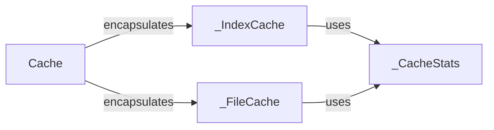

## Component Details

The Cache Manager component in proxpi is responsible for managing and providing access to cached package indexes and files. It abstracts the underlying caching mechanisms, offering a unified interface for interacting with different cache types. The component tracks cache statistics to monitor performance and identify areas for improvement. It handles cache invalidation and interacts with upstream PyPI servers to retrieve package information when it's not available in the cache.

### Cache
The Cache class provides a high-level interface for interacting with the cache subsystem. It encapsulates the IndexCache and FileCache, providing methods for listing packages, projects, and files, as well as retrieving files from the cache. It also handles cache invalidation and provides access to cache statistics.
- **Related Classes/Methods**: `proxpi.src.proxpi._cache.Cache`

### _IndexCache
The _IndexCache class manages the caching of package indexes. It stores information about available packages and their files, allowing for quick retrieval of package lists and file URLs. It interacts with the upstream PyPI server to retrieve package information when it's not available in the cache. It uses _CacheStats to track cache performance.
- **Related Classes/Methods**: `proxpi.src.proxpi._cache._IndexCache`

### _FileCache
The _FileCache class manages the caching of package files. It stores downloaded files in a local directory, allowing for quick retrieval of files without having to download them from the upstream PyPI server every time. It handles file downloads, caching, and retrieval. It uses _CacheStats to track cache performance.
- **Related Classes/Methods**: `proxpi.src.proxpi._cache._FileCache`

### _CacheStats
The _CacheStats class tracks statistics about cache hits and misses. It provides a simple way to monitor the performance of the cache and identify areas for improvement. It is used by both _IndexCache and _FileCache.
- **Related Classes/Methods**: `proxpi.src.proxpi._cache._CacheStats`, `proxpi.src.proxpi._cache._CacheStats:_add_stat`, `proxpi.src.proxpi._cache._CacheStats:add_hit`, `proxpi.src.proxpi._cache._CacheStats:add_miss`
