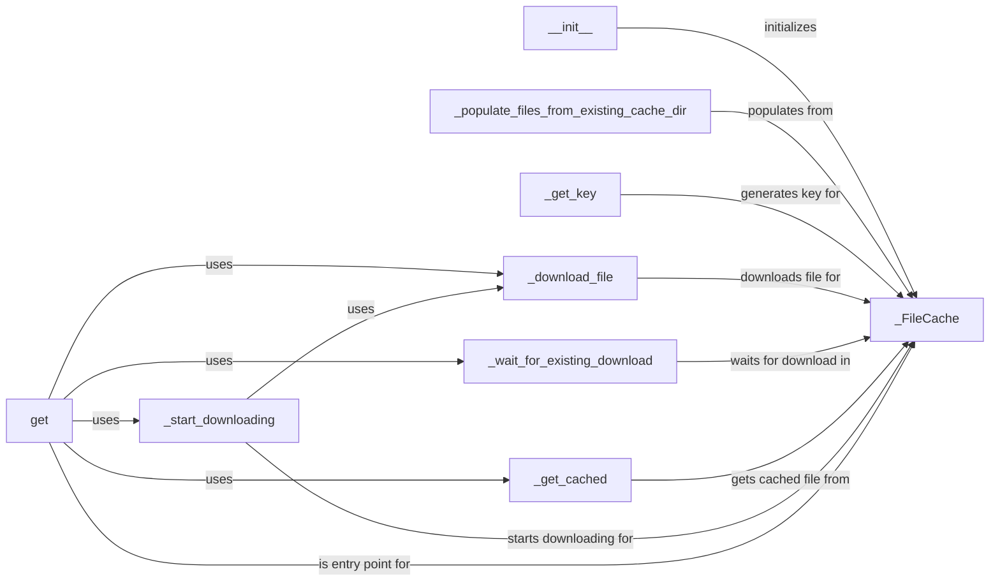

## Component Details

The File Cache component is responsible for caching files downloaded from remote PyPI servers. It manages a local cache directory, downloads files if they are not already cached, and retrieves files from the cache when available. The component uses a lock to prevent concurrent downloads of the same file, ensuring that only one download occurs at a time. It interacts with the Cache Manager to store and retrieve file data, minimizing network traffic and improving download speeds for package files.

### _FileCache
The `_FileCache` class manages the caching of files. It handles initializing the cache directory, populating the cache from existing files, retrieving files from the cache, and downloading files if they are not already cached. It uses a lock to prevent concurrent downloads of the same file.
- **Related Classes/Methods**: `proxpi.src.proxpi._cache._FileCache`

### __init__
The `__init__` method initializes the `_FileCache` instance. It sets up the cache directory, creates a lock for managing concurrent downloads, and populates the cache with existing files.
- **Related Classes/Methods**: `proxpi.src.proxpi._cache._FileCache:__init__`

### _populate_files_from_existing_cache_dir
The `_populate_files_from_existing_cache_dir` method populates the cache by scanning the existing cache directory and adding the files to the cache. It iterates through the files in the cache directory and adds them to the internal cache dictionary.
- **Related Classes/Methods**: `proxpi.src.proxpi._cache._FileCache:_populate_files_from_existing_cache_dir`

### _get_key
The `_get_key` method generates a unique key for a given file based on its URL. This key is used to identify the file in the cache.
- **Related Classes/Methods**: `proxpi.src.proxpi._cache._FileCache:_get_key`

### _download_file
The `_download_file` method downloads a file from a given URL and saves it to the cache directory. It uses the `requests` library to download the file and handles potential errors during the download process.
- **Related Classes/Methods**: `proxpi.src.proxpi._cache._FileCache:_download_file`

### _wait_for_existing_download
The `_wait_for_existing_download` method waits for an existing download to complete, preventing multiple downloads of the same file. It uses a lock to synchronize access to the download process.
- **Related Classes/Methods**: `proxpi.src.proxpi._cache._FileCache:_wait_for_existing_download`

### _get_cached
The `_get_cached` method retrieves a file from the cache, returning the file path if it exists or None if it doesn't. It checks if the file exists in the cache directory and returns the path if found.
- **Related Classes/Methods**: `proxpi.src.proxpi._cache._FileCache:_get_cached`

### _start_downloading
The `_start_downloading` method initiates the download of a file, ensuring that only one download occurs at a time. It uses a lock to prevent concurrent downloads and calls the `_download_file` method to perform the actual download.
- **Related Classes/Methods**: `proxpi.src.proxpi._cache._FileCache:_start_downloading`

### get
The `get` method is the main entry point for retrieving a file. It checks if the file is cached, downloads it if necessary, and returns the file path. It orchestrates the entire caching and download process.
- **Related Classes/Methods**: `proxpi.src.proxpi._cache._FileCache:get`
