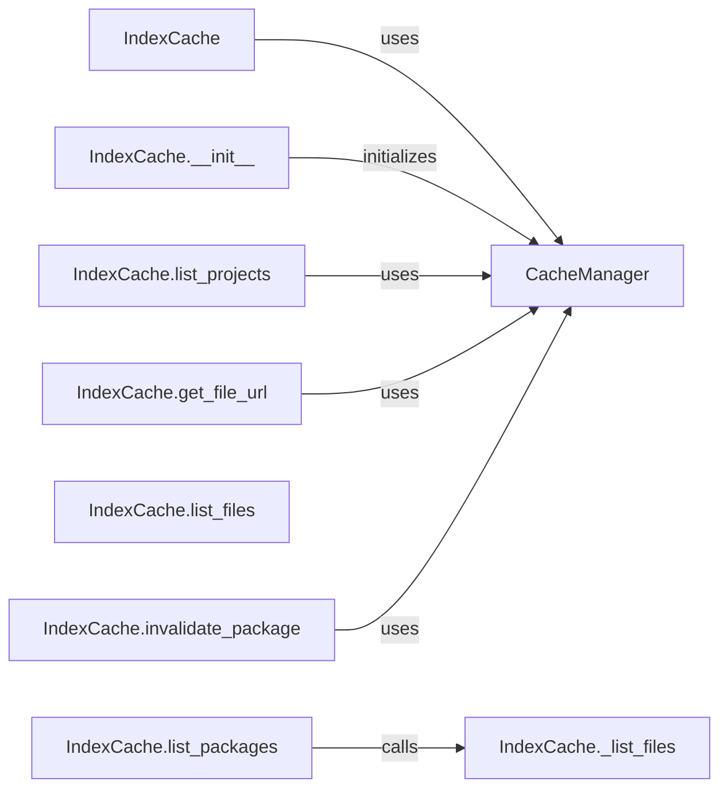

## Component Details

The Index Cache component caches package indexes (lists of packages and files) to speed up package listing operations. It interacts with the Cache Manager to store and retrieve index data, reducing the load on the upstream PyPI server for frequently accessed package lists. The main flow involves checking the cache for package information, and if it's not available, fetching it from the upstream PyPI server and storing it in the cache. The component also provides methods for invalidating the cache when necessary.

### IndexCache
The main class responsible for caching package index information. It initializes the cache and provides methods for interacting with it. It uses a CacheManager to handle the actual caching.
- **Related Classes/Methods**: `proxpi.src.proxpi._cache._IndexCache`

### IndexCache.__init__
Initializes the IndexCache, setting up the cache storage. It receives a CacheManager instance during initialization, which it uses for all cache interactions.
- **Related Classes/Methods**: `proxpi.src.proxpi._cache._IndexCache:__init__`

### IndexCache.list_packages
Lists all packages in the index, retrieving them from the cache if available or fetching them from the source. It calls the internal method `_list_packages` to handle the actual retrieval and caching logic.
- **Related Classes/Methods**: `proxpi.src.proxpi._cache._IndexCache:list_packages`

### IndexCache.list_projects
Lists all projects in the index, using cached data or fetching from the source. It interacts with the CacheManager to retrieve the list of projects.
- **Related Classes/Methods**: `proxpi.src.proxpi._cache._IndexCache:list_projects`

### IndexCache._list_files
Lists files associated with a specific package, using cached data or fetching from the source. This is an internal method called by `list_files`.
- **Related Classes/Methods**: `proxpi.src.proxpi._cache._IndexCache:_list_files`

### IndexCache.list_files
Public interface to list files associated with a package. It calls the internal method `_list_files` to handle the actual retrieval and caching logic.
- **Related Classes/Methods**: `proxpi.src.proxpi._cache._IndexCache:list_files`

### IndexCache.get_file_url
Retrieves the URL for a specific file, potentially using cached information. It interacts with the CacheManager to retrieve the file URL.
- **Related Classes/Methods**: `proxpi.src.proxpi._cache._IndexCache:get_file_url`

### IndexCache.invalidate_package
Invalidates the cache for a specific package, forcing a refresh on the next access. It interacts with the CacheManager to invalidate the cache entry for the package.
- **Related Classes/Methods**: `proxpi.src.proxpi._cache._IndexCache:invalidate_package`

### CacheManager
The CacheManager is responsible for managing the underlying cache storage. The `IndexCache` uses the CacheManager to store and retrieve data.
- **Related Classes/Methods**: `proxpi.src.proxpi._cache.CacheManager`
