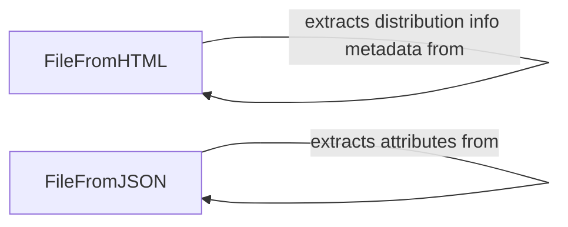

## Component Details

The Metadata Extractor component is responsible for extracting file metadata from HTML and JSON responses obtained from PyPI. It consists of two main classes, `FileFromHTML` and `FileFromJSON`, which handle parsing and extracting metadata from different response types. The extracted metadata includes file attributes, hashes, distribution info, and fragments, which are then used by the File Cache to populate file metadata, enabling efficient file retrieval and verification.

### FileFromHTML
This class handles the creation of file representations from HTML elements. It parses HTML to extract file metadata, including hashes and distribution info metadata. It uses `from_html_element` to parse the HTML and extract the relevant information.
- **Related Classes/Methods**: `proxpi.src.proxpi._cache.FileFromHTML`, `proxpi.src.proxpi._cache.FileFromHTML:from_html_element`, `proxpi.src.proxpi._cache.FileFromHTML:hashes`, `proxpi.src.proxpi._cache.FileFromHTML:dist_info_metadata`

### FileFromJSON
This class handles the creation of file representations from JSON responses. It parses JSON to extract file metadata, including fragments and attributes. It uses `from_json_response` to parse the JSON and extract the relevant information.
- **Related Classes/Methods**: `proxpi.src.proxpi._cache.FileFromJSON`, `proxpi.src.proxpi._cache.FileFromJSON:from_json_response`, `proxpi.src.proxpi._cache.FileFromJSON:fragment`, `proxpi.src.proxpi._cache.FileFromJSON:attributes`
