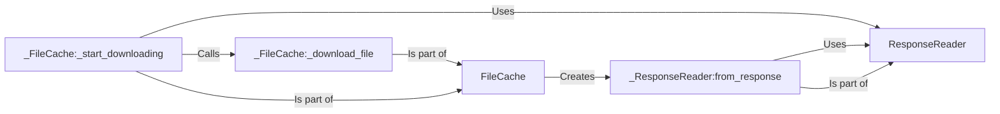

## Component Details

The Response Reader component is responsible for handling HTTP responses received during file downloads from PyPI, ensuring data integrity and proper stream management. It works closely with the File Cache component, which manages the caching of downloaded files. The File Cache uses the Response Reader to process the response body and save it to the cache. The process begins when the File Cache determines that a file needs to be downloaded. It then initiates the download, receives the HTTP response, and uses the Response Reader to read and process the response stream. The Response Reader ensures that the downloaded data is complete and valid before it is stored in the cache.

### ResponseReader
Reads and processes HTTP responses from PyPI, handling data streams and error conditions during file downloads. It encapsulates the logic for reading the response body and ensuring its integrity.
- **Related Classes/Methods**: `proxpi.src.proxpi._cache._ResponseReader`

### FileCache
Manages the caching of files downloaded from PyPI. It checks if a file is already cached, initiates downloads if not, and stores the downloaded file in the cache. It uses ResponseReader to handle the HTTP response during the download process.
- **Related Classes/Methods**: `proxpi.src.proxpi._cache._FileCache`

### _ResponseReader:from_response
Creates a ResponseReader instance from an HTTP response. This method is responsible for initializing the ResponseReader with the response object and preparing it for reading the response body.
- **Related Classes/Methods**: `proxpi.src.proxpi._cache._ResponseReader:from_response`

### _FileCache:_download_file
Downloads a file from PyPI and stores it in the cache. This method handles the actual file download process, including making the HTTP request, reading the response, and writing the file to the cache.
- **Related Classes/Methods**: `proxpi.src.proxpi._cache._FileCache:_download_file`

### _FileCache:_start_downloading
Initiates the file download process. This method sets up the download task and manages the download progress. It might involve creating a background task or thread to perform the download.
- **Related Classes/Methods**: `proxpi.src.proxpi._cache._FileCache:_start_downloading`
