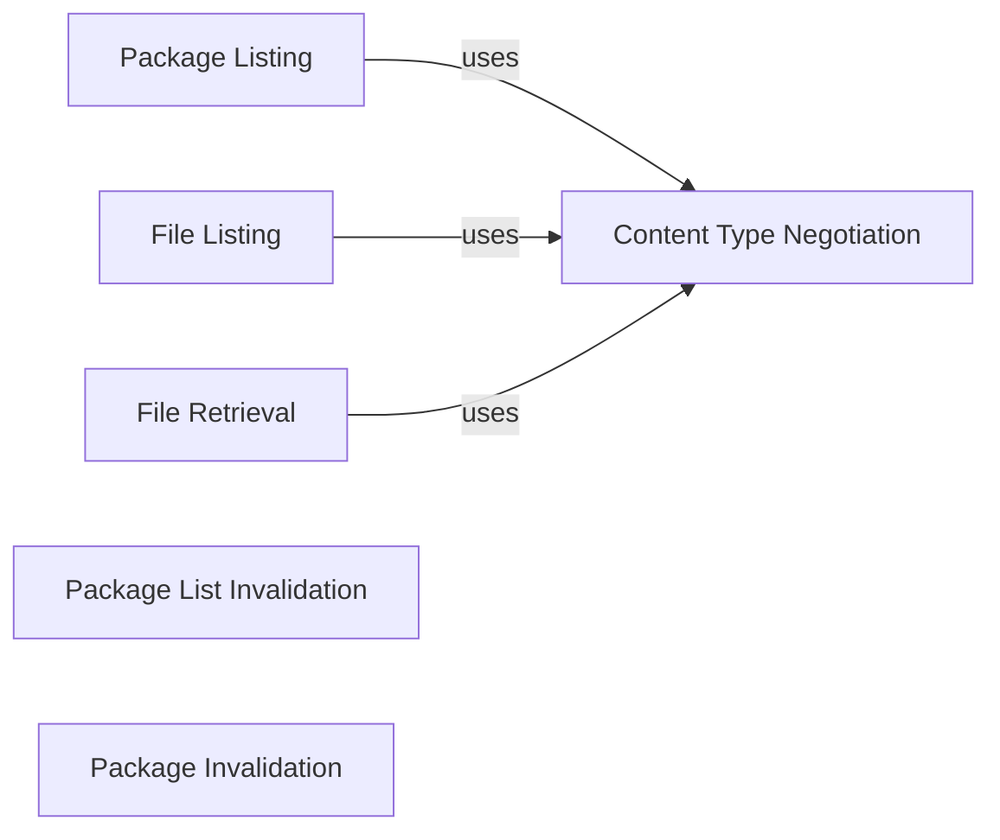

## Component Details

The proxpi server interface handles incoming HTTP requests to serve package information, including listing packages, retrieving files, and invalidating cache entries. It acts as the entry point for client interactions, routing requests to the appropriate handlers and interacting with the cache manager to ensure data consistency and availability. The server supports both JSON and HTML responses, adapting to the client's preferences based on the 'Accept' header.

### Package Listing
This component is responsible for listing all available packages. It retrieves the package list from the cache or backend, formats it according to the client's requested content type (JSON or HTML), and returns the response. It interacts with the cache manager to fetch the latest package list and uses the _wants_json function to determine the response format.
- **Related Classes/Methods**: `proxpi.src.proxpi.server:list_packages`

### File Listing
This component lists files for a specific package. It retrieves the file list for the requested package, formats it according to the client's requested content type (JSON or HTML), and returns the response. It interacts with the cache manager to fetch the file list and uses the _wants_json function to determine the response format.
- **Related Classes/Methods**: `proxpi.src.proxpi.server:list_files`

### File Retrieval
This component retrieves a specific file from a package. It fetches the requested file, sets the appropriate content type in the response, and returns the file content. It interacts with the cache manager to fetch the file and uses the _wants_json function to determine the response format.
- **Related Classes/Methods**: `proxpi.src.proxpi.server:get_file`

### Package List Invalidation
This component invalidates the cached list of packages. This triggers a refresh of the package list cache, ensuring that subsequent requests receive the most up-to-date information. It interacts with the cache manager to invalidate the package list.
- **Related Classes/Methods**: `proxpi.src.proxpi.server:invalidate_list`

### Package Invalidation
This component invalidates the cached data for a specific package. This triggers a refresh of the cache for the specified package, ensuring that subsequent requests for that package receive the most up-to-date information. It interacts with the cache manager to invalidate the package.
- **Related Classes/Methods**: `proxpi.src.proxpi.server:invalidate_package`

### Content Type Negotiation
This component determines if the client requests JSON responses based on the 'Accept' header in the HTTP request. This function helps in deciding the format of the response. It inspects the request headers and returns a boolean value indicating whether JSON is preferred.
- **Related Classes/Methods**: `proxpi.src.proxpi.server:_wants_json`
