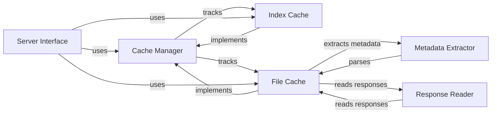

## Component Details

The proxpi project implements a caching proxy for PyPI (Python Package Index). It sits between clients requesting Python packages and the upstream PyPI server, caching package indexes and files to reduce latency and network traffic. The main flow involves the server receiving requests, checking the cache for the requested resources, retrieving them from the cache if available, or fetching them from the upstream PyPI server, caching them, and then serving them to the client.

### Server Interface
The Server Interface component handles incoming HTTP requests for listing packages, retrieving files, and invalidating cache entries. It exposes the API endpoints and interacts with the Cache Manager to serve requests, acting as the entry point for all client interactions.
- **Related Classes/Methods**: `proxpi.src.proxpi.server:list_packages`, `proxpi.src.proxpi.server:list_files`, `proxpi.src.proxpi.server:get_file`, `proxpi.src.proxpi.server:invalidate_list`, `proxpi.src.proxpi.server:invalidate_package`, `proxpi.src.proxpi.server:_wants_json`

### Cache Manager
The Cache Manager component abstracts the caching mechanism, providing interfaces for managing package indexes and files. It defines the base class for cache implementations and encapsulates cache statistics, providing a unified interface for interacting with different cache types.
- **Related Classes/Methods**: `proxpi.src.proxpi._cache.Cache`, `proxpi.src.proxpi._cache._CacheStats`, `proxpi.src.proxpi._cache._CacheStats:_add_stat`, `proxpi.src.proxpi._cache._CacheStats:add_hit`, `proxpi.src.proxpi._cache._CacheStats:add_miss`

### Index Cache
The Index Cache component caches package indexes (lists of packages and files) to speed up package listing operations. It interacts with the Cache Manager to store and retrieve index data, reducing the load on the upstream PyPI server for frequently accessed package lists.
- **Related Classes/Methods**: `proxpi.src.proxpi._cache._IndexCache`, `proxpi.src.proxpi._cache._IndexCache:__init__`, `proxpi.src.proxpi._cache._IndexCache:_list_packages`, `proxpi.src.proxpi._cache._IndexCache:list_packages`, `proxpi.src.proxpi._cache._IndexCache:list_projects`, `proxpi.src.proxpi._cache._IndexCache:_list_files`, `proxpi.src.proxpi._cache._IndexCache:list_files`, `proxpi.src.proxpi._cache._IndexCache:get_file_url`, `proxpi.src.proxpi._cache._IndexCache:invalidate_package`

### File Cache
The File Cache component caches individual package files to reduce download times. It handles downloading files from remote PyPI servers and storing them locally. It interacts with the Cache Manager to store and retrieve file data, minimizing network traffic and improving download speeds for package files.
- **Related Classes/Methods**: `proxpi.src.proxpi._cache._FileCache`, `proxpi.src.proxpi._cache._FileCache:__init__`, `proxpi.src.proxpi._cache._FileCache:_populate_files_from_existing_cache_dir`, `proxpi.src.proxpi._cache._FileCache:_get_key`, `proxpi.src.proxpi._cache._FileCache:_download_file`, `proxpi.src.proxpi._cache._FileCache:_wait_for_existing_download`, `proxpi.src.proxpi._cache._FileCache:_get_cached`, `proxpi.src.proxpi._cache._FileCache:_start_downloading`, `proxpi.src.proxpi._cache._FileCache:get`

### Metadata Extractor
The Metadata Extractor component extracts file metadata from HTML and JSON responses from PyPI. It parses the responses and provides access to file attributes and hashes. It is used by the File Cache to populate file metadata, enabling efficient file retrieval and verification.
- **Related Classes/Methods**: `proxpi.src.proxpi._cache.FileFromHTML`, `proxpi.src.proxpi._cache.FileFromHTML:from_html_element`, `proxpi.src.proxpi._cache.FileFromHTML:hashes`, `proxpi.src.proxpi._cache.FileFromHTML:dist_info_metadata`, `proxpi.src.proxpi._cache.FileFromJSON`, `proxpi.src.proxpi._cache.FileFromJSON:from_json_response`, `proxpi.src.proxpi._cache.FileFromJSON:fragment`, `proxpi.src.proxpi._cache.FileFromJSON:attributes`

### Response Reader
The Response Reader component reads and processes HTTP responses from PyPI. It is used by the File Cache to handle responses during file downloads, ensuring proper handling of data streams and error conditions.
- **Related Classes/Methods**: `proxpi.src.proxpi._cache._ResponseReader`, `proxpi.src.proxpi._cache._ResponseReader:from_response`