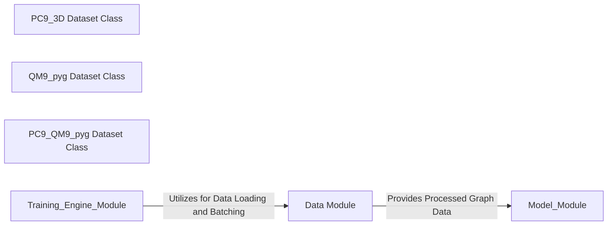

## Details

Analysis of the Data Module, a fundamental component for handling graph datasets for Graph Neural Networks (GNNs) in computational chemistry, adhering to 'Data Flow Architecture' and 'Modular Design' patterns.

### PC9_3D Dataset Class
This class, found in `pseudo/dataset/PC9_pyg.py`, is responsible for loading, processing, and managing the PC9 graph dataset. It inherits from `torch_geometric.data.InMemoryDataset`, which is optimized for datasets that fit into memory. It handles the conversion of raw data (e.g., from a pickle file) into PyTorch Geometric `Data` objects, including atomic coordinates (`pos`), atomic numbers (`z`), and various target properties (e.g., HOMO, LUMO, gap, energy). It also provides methods for splitting the dataset into training, validation, and test sets.

**Related Classes/Methods**:

- `PC9_3D`

### QM9_pyg Dataset Class
Based on the file structure, it is highly probable that `pseudo/dataset/QM9_pyg.py` contains a similar `InMemoryDataset` implementation for the QM9 dataset, performing analogous data loading, processing, and management functions tailored to the QM9 dataset's specific structure and properties.

**Related Classes/Methods**:

- <a href="https://github.com/pfizer-opensource/pseudo/blob/main/pseudo/dataset/QM9_pyg.py" target="_blank" rel="noopener noreferrer">`QM9_pyg`</a>

### PC9_QM9_pyg Dataset Class
This file (`pseudo/dataset/PC9_QM9_pyg.py`) likely contains an `InMemoryDataset` implementation that combines or handles both PC9 and QM9 datasets, potentially for joint training or specific experimental setups.

**Related Classes/Methods**:

- <a href="https://github.com/pfizer-opensource/pseudo/blob/main/pseudo/dataset/PC9_QM9_pyg.py" target="_blank" rel="noopener noreferrer">`PC9_QM9_pyg`</a>

### Data Module [[Expand]](./Data_Module.md)
Encapsulates all logic related to loading, preprocessing, and providing graph datasets (PC9, QM9) in a format suitable for PyTorch Geometric GNNs. It ensures data integrity, efficient access, and proper splitting for machine learning tasks.

**Related Classes/Methods**:

- `PC9_3D`
- <a href="https://github.com/pfizer-opensource/pseudo/blob/main/pseudo/dataset/QM9_pyg.py" target="_blank" rel="noopener noreferrer">`QM9_pyg`</a>
- <a href="https://github.com/pfizer-opensource/pseudo/blob/main/pseudo/dataset/PC9_QM9_pyg.py" target="_blank" rel="noopener noreferrer">`PC9_QM9_pyg`</a>

### [FAQ](https://github.com/CodeBoarding/GeneratedOnBoardings/tree/main?tab=readme-ov-file#faq)