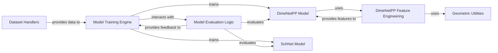

## Details

One paragraph explaining the functionality which is represented by this graph. What the main flow is and what is its purpose.

### DimeNetPP Model
Implements the DimeNet++ Graph Neural Network architecture, a sophisticated message-passing neural network designed for molecular property prediction. It orchestrates the flow of data through its various internal layers, leveraging angular and radial information for accurate predictions.

**Related Classes/Methods**:

- <a href="https://github.com/pfizer-opensource/pseudo/blob/main/pseudo/method/dimenetpp/dimenetpp.py#L1-L1" target="_blank" rel="noopener noreferrer">`pseudo.method.dimenetpp.dimenetpp` (1:1)</a>

### SchNet Model
Implements the SchNet Graph Neural Network architecture, another prominent message-passing neural network tailored for molecular simulations, with a focus on interactions between atoms. It processes graph structures to learn atomic and molecular properties.

**Related Classes/Methods**:

- <a href="https://github.com/pfizer-opensource/pseudo/blob/main/pseudo/method/schnet/schnet.py#L1-L1" target="_blank" rel="noopener noreferrer">`pseudo.method.schnet.schnet` (1:1)</a>

### DimeNetPP Feature Engineering
Provides specialized functions for generating input features crucial for the DimeNetPP model. This includes the computation of Bessel basis functions and real spherical harmonics, essential for encoding angular and distance information within the graph structure.

**Related Classes/Methods**:

- <a href="https://github.com/pfizer-opensource/pseudo/blob/main/pseudo/method/dimenetpp/features.py#L1-L1" target="_blank" rel="noopener noreferrer">`pseudo.method.dimenetpp.features` (1:1)</a>

### Model Training Engine
Orchestrates the training and inference processes for the GNN models, managing training loops, optimization, and model lifecycle. It acts as the central orchestrator for model execution.

**Related Classes/Methods**:

- <a href="https://github.com/pfizer-opensource/pseudo/blob/main/pseudo/method/run.py#L66-L341" target="_blank" rel="noopener noreferrer">`pseudo.method.run` (66:341)</a>

### Model Evaluation Logic
Defines metrics and procedures for assessing the predictive performance of the trained GNN models, ensuring the quality and reliability of the learned representations.

**Related Classes/Methods**:

- <a href="https://github.com/pfizer-opensource/pseudo/blob/main/pseudo/evaluation/eval.py#L1-L1" target="_blank" rel="noopener noreferrer">`pseudo.evaluation.eval` (1:1)</a>

### Geometric Utilities
Offers foundational utilities for geometric calculations, essential for feature engineering in GNNs, particularly for encoding spatial relationships and angular information.

**Related Classes/Methods**:

- <a href="https://github.com/pfizer-opensource/pseudo/blob/main/pseudo/utils/geometric_computing.py#L1-L1" target="_blank" rel="noopener noreferrer">`pseudo.utils.geometric_computing` (1:1)</a>

### Dataset Handlers
Responsible for loading, preprocessing, and providing structured graph data to the GNN models, abstracting data access and batching for efficient model training and inference.

**Related Classes/Methods**:

- <a href="https://github.com/pfizer-opensource/pseudo/blob/main/pseudo/dataset/PC9_QM9_pyg.py#L1-L1" target="_blank" rel="noopener noreferrer">`pseudo.dataset.PC9_QM9_pyg` (1:1)</a>

### [FAQ](https://github.com/CodeBoarding/GeneratedOnBoardings/tree/main?tab=readme-ov-file#faq)