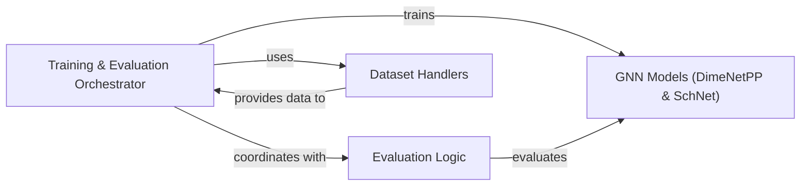

## Details

The Training & Evaluation Module is the operational core of the project, orchestrating the entire lifecycle of Graph Neural Network (GNN) models from data ingestion to performance assessment. It embodies the project's "Experimentation Focus" and "Configuration-Driven Execution" by providing a structured and reproducible environment for model development and analysis.

### Training & Evaluation Orchestrator
This is the primary control unit of the module. It manages the end-to-end process of training, validation, prediction, and evaluation of GNN models. Its responsibilities include loading data, performing model forward passes, calculating loss (including evidential regression losses), executing optimizer steps, and coordinating with the evaluation logic to compute performance metrics. It acts as the central hub, integrating various other components to facilitate the deep learning pipeline.

**Related Classes/Methods**:

- <a href="https://github.com/pfizer-opensource/pseudo/blob/main/pseudo/method/run.py#L66-L341" target="_blank" rel="noopener noreferrer">`pseudo.method.run` (66:341)</a>

### Evaluation Logic
This component encapsulates the specific functions and methodologies for assessing the performance of trained GNN models. It calculates key metrics such as Mean Absolute Error (MAE), Root Mean Squared Error (RMSE), and potentially other relevant metrics on validation and test datasets. It provides the quantitative feedback necessary to understand model effectiveness and guide further research.

**Related Classes/Methods**:

- <a href="https://github.com/pfizer-opensource/pseudo/blob/main/pseudo/evaluation/eval.py#L1-L1" target="_blank" rel="noopener noreferrer">`pseudo.evaluation.eval` (1:1)</a>

### GNN Models (DimeNetPP & SchNet)
These components represent the specific Graph Neural Network architectures (DimeNetPP and SchNet) that are the subject of training and evaluation. They define the computational graphs and layers through which molecular data is processed to predict properties. The Training & Evaluation Orchestrator interacts with these models by feeding them data for forward passes and receiving their outputs for loss calculation.

**Related Classes/Methods**:

- <a href="https://github.com/pfizer-opensource/pseudo/blob/main/pseudo/method/dimenetpp/dimenetpp.py#L1-L1" target="_blank" rel="noopener noreferrer">`pseudo.method.dimenetpp.dimenetpp` (1:1)</a>
- <a href="https://github.com/pfizer-opensource/pseudo/blob/main/pseudo/method/schnet/schnet.py#L1-L1" target="_blank" rel="noopener noreferrer">`pseudo.method.schnet.schnet` (1:1)</a>

### Dataset Handlers
This component is responsible for loading, preprocessing, and providing graph datasets (e.g., QM9, PC9) in a format compatible with PyTorch-Geometric and the GNN models. It ensures that the data is correctly prepared and accessible for both training and evaluation phases.

**Related Classes/Methods**:

- <a href="https://github.com/pfizer-opensource/pseudo/blob/main/pseudo/dataset/QM9_pyg.py#L1-L1" target="_blank" rel="noopener noreferrer">`pseudo.dataset.QM9_pyg` (1:1)</a>
- <a href="https://github.com/pfizer-opensource/pseudo/blob/main/pseudo/dataset/PC9_pyg.py#L1-L1" target="_blank" rel="noopener noreferrer">`pseudo.dataset.PC9_pyg` (1:1)</a>
- <a href="https://github.com/pfizer-opensource/pseudo/blob/main/pseudo/dataset/PC9_QM9_pyg.py#L1-L1" target="_blank" rel="noopener noreferrer">`pseudo.dataset.PC9_QM9_pyg` (1:1)</a>

### [FAQ](https://github.com/CodeBoarding/GeneratedOnBoardings/tree/main?tab=readme-ov-file#faq)