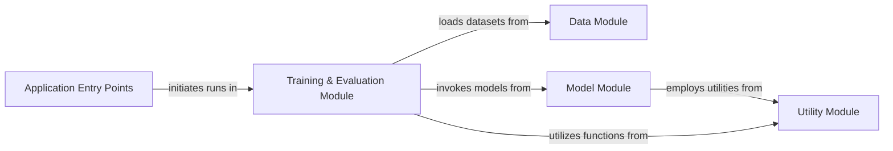

## Details

The `pseudo` project, a Deep Learning Research Prototype for Graph Neural Networks in Scientific Machine Learning, exhibits a modular and data-flow-centric architecture. The system is structured around five core components, ensuring clear separation of concerns and supporting experimentation.

### Data Module [[Expand]](./Data_Module.md)
Responsible for loading, preprocessing, and managing graph datasets (e.g., PC9, QM9). It provides the necessary data structures and iterators for training and evaluation, ensuring data is correctly formatted for the GNN models.

**Related Classes/Methods**:

- `pseudo.dataset` (1:1)

### Model Module [[Expand]](./Model_Module.md)
Encapsulates all Graph Neural Network architectures (DimeNetPP, SchNet) and their specific feature engineering components (e.g., Bessel basis, spherical harmonics). It defines the forward pass logic for learning representations from graph structures.

**Related Classes/Methods**:

- `pseudo.method.dimenetpp` (1:1)
- `pseudo.method.schnet` (1:1)

### Training & Evaluation Module [[Expand]](./Training_Evaluation_Module.md)
Orchestrates the entire training, validation, prediction, and evaluation lifecycle of the GNN models. It integrates data loading, model forward passes, loss calculation (including evidential regression losses), optimizer steps, and performance metric computation.

**Related Classes/Methods**:

- <a href="https://github.com/pfizer-opensource/pseudo/blob/main/pseudo/method/run.py#L66-L341" target="_blank" rel="noopener noreferrer">`pseudo.method.run` (66:341)</a>
- `pseudo.evaluation` (1:1)

### Utility Module
Provides general-purpose helper functions that can be used across different parts of the project, particularly for geometric computations and other common tasks that support the main modules.

**Related Classes/Methods**:

- `pseudo.utils` (1:1)

### Application Entry Points
Serves as the primary interfaces for users to interact with the system. This includes top-level scripts for initiating training runs and interactive notebooks for conducting experiments, demonstrating model usage, and visualizing results.

**Related Classes/Methods**:

- <a href="https://github.com/pfizer-opensource/pseudo/blob/main/train.py#L1-L1" target="_blank" rel="noopener noreferrer">`train` (1:1)</a>
- `demo` (1:1)

### [FAQ](https://github.com/CodeBoarding/GeneratedOnBoardings/tree/main?tab=readme-ov-file#faq)