```mermaid
graph LR
    Core_Psychrometric_Library["Core Psychrometric Library"]
    Data_Input_Output["Data Input/Output"]
    Viewer_Application["Viewer Application"]
    Data_Input_Output -- "sends raw input parameters to" --> Core_Psychrometric_Library
    Core_Psychrometric_Library -- "provides calculated data and objects to" --> Viewer_Application
    click Core_Psychrometric_Library href "https://github.com/CodeBoarding/GeneratedOnBoardings/blob/main/psych.js/Core_Psychrometric_Library.md" "Details"
    click Viewer_Application href "https://github.com/CodeBoarding/GeneratedOnBoardings/blob/main/psych.js/Viewer_Application.md" "Details"
```

## Details

One paragraph explaining the functionality which is represented by this graph. What the main flow is and what is its purpose.

### Core Psychrometric Library [[Expand]](./Core_Psychrometric_Library.md)
This component serves as the foundational computational engine for the entire system, encapsulating all fundamental psychrometric calculation logic. It provides a comprehensive set of functions and classes necessary for defining and manipulating psychrometric entities such as points and lines, and for performing complex calculations related to mixed airflows and various psychrometric properties (e.g., dry-bulb temperature, wet-bulb temperature, humidity ratio, enthalpy). It is designed to be a robust and independent backend for psychrometric computations, ensuring accuracy and consistency across the application.

**Related Classes/Methods**:

- `psych.js` (1:99999)
- `components/psych_calcs.js` (1:99999)
- `components/psych_line.js` (1:99999)
- `components/psych_mixed_flow.js` (1:99999)
- `components/psych_point.js` (1:99999)
- `components/psych_point_builder.js` (1:99999)

### Data Input/Output
This component is responsible for managing the input of raw psychrometric parameters from users or other sources, and potentially for handling the output of processed data. It acts as the interface for providing the necessary initial conditions and values to the `Core Psychrometric Library` for calculations.

**Related Classes/Methods**: _None_

### Viewer Application [[Expand]](./Viewer_Application.md)
This component is responsible for presenting the calculated psychrometric data and objects in a user-friendly format. It consumes the processed information from the `Core Psychrometric Library` and visualizes it, likely through charts, tables, or interactive diagrams, to provide insights to the user.

**Related Classes/Methods**: _None_

### [FAQ](https://github.com/CodeBoarding/GeneratedOnBoardings/tree/main?tab=readme-ov-file#faq)