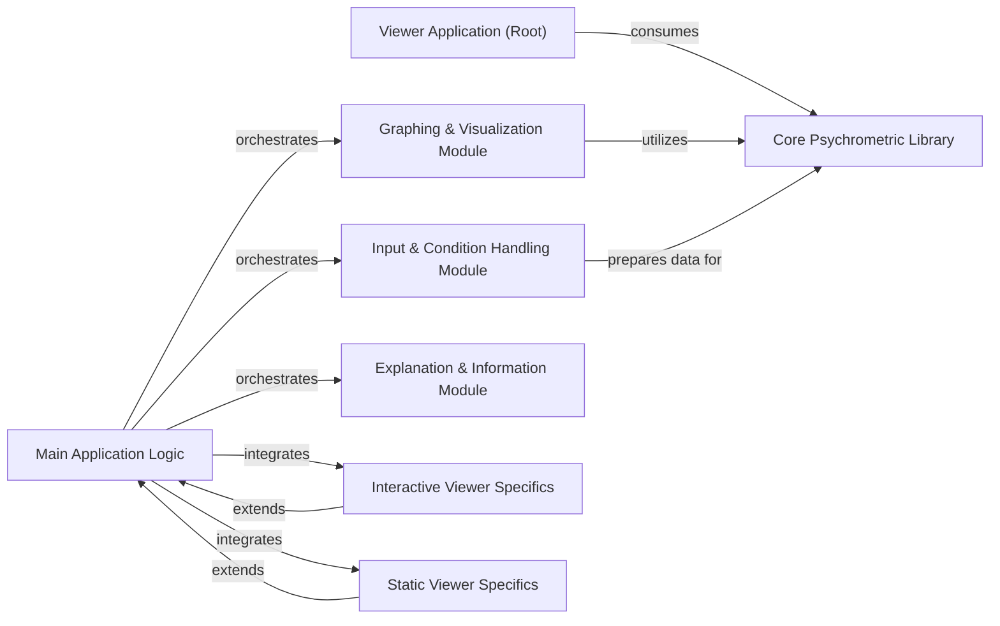

## Details

One paragraph explaining the functionality which is represented by this graph. What the main flow is and what is its purpose.

### Viewer Application (Root)
The overarching client-side web application, serving as the primary user interface. It integrates all sub-modules to present a cohesive user experience for psychrometric data visualization and interaction.

**Related Classes/Methods**:

- `viewer.index` (1:1)
- `viewer.interactive.index` (1:1)
- `viewer.static.index` (1:1)

### Main Application Logic
The central orchestrator for the viewer application. It handles overall application flow, initialization, and coordination between different UI modules, acting as the primary script that ties the various functionalities together.

**Related Classes/Methods**:

- `viewer.assets.scripts.script` (1:1)

### Graphing & Visualization Module
Responsible for rendering psychrometric charts and heatmaps. It takes processed data and translates it into interactive or static visual representations for the user.

**Related Classes/Methods**:

- `viewer.assets.scripts.graph` (1:1)
- `viewer.assets.scripts.heatmap` (1:1)

### Input & Condition Handling Module
Manages user input related to psychrometric conditions. It handles data validation, parsing, and prepares the input for processing by the underlying psychrometric calculation logic.

**Related Classes/Methods**:

- `viewer.assets.scripts.condition` (1:1)

### Explanation & Information Module
Provides contextual information, explanations, or help related to psychrometric concepts or the application's features, enhancing user understanding and usability.

**Related Classes/Methods**:

- `viewer.assets.scripts.explain` (1:1)

### Interactive Viewer Specifics
Contains logic specific to the interactive mode of the viewer. This includes handling real-time updates, dynamic user interactions, and potentially more complex UI behaviors unique to the interactive experience.

**Related Classes/Methods**:

- `viewer.interactive.script` (1:1)

### Static Viewer Specifics
Contains logic specific to the static mode of the viewer. This might involve displaying pre-calculated results, non-interactive charts, or simplified UI elements for a read-only experience.

**Related Classes/Methods**:

- `viewer.static.script` (1:1)

### Core Psychrometric Library [[Expand]](./Core_Psychrometric_Library.md)
An external library providing core psychrometric data processing and calculations.

**Related Classes/Methods**: _None_

### [FAQ](https://github.com/CodeBoarding/GeneratedOnBoardings/tree/main?tab=readme-ov-file#faq)