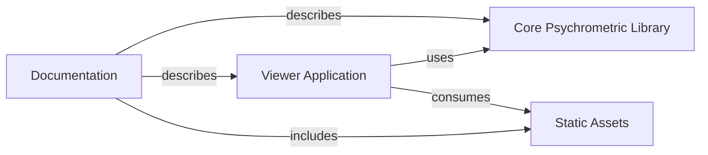

## Details

The `psych.js` project is architected as a JavaScript Utility Library with a complementary Web Application Viewer. At its core, the Core Psychrometric Library provides the fundamental computational engine for psychrometric calculations, defining points, lines, and handling mixed airflows. The Viewer Application acts as the client-side graphical user interface, consuming the functionalities of the Core Psychrometric Library to visualize data and interact with psychrometric properties, while also relying on Static Assets for its visual presentation. Comprehensive Documentation supports both developers and users by describing the Core Psychrometric Library, the Viewer Application, and referencing the Static Assets, ensuring clarity and usability across the project.

### Core Psychrometric Library [[Expand]](./Core_Psychrometric_Library.md)
This component encapsulates the fundamental psychrometric calculation logic. It provides a set of functions and classes for defining psychrometric points, lines, and performing various calculations related to mixed airflows and psychrometric properties. It serves as the backend computational engine for the entire system.

**Related Classes/Methods**:

- `psych.js` (1:1)
- `components/psych_calcs.js` (1:1)
- `components/psych_line.js` (1:1)
- `components/psych_mixed_flow.js` (1:1)
- `components/psych_point.js` (1:1)
- `components/psych_point_builder.js` (1:1)

### Viewer Application [[Expand]](./Viewer_Application.md)
This component represents the client-side web application responsible for providing a graphical user interface (GUI) to interact with and visualize psychrometric data. It consumes the functionalities exposed by the Core Psychrometric Library to display charts, allow user input, and present calculated results. It handles all aspects of the user experience and application logic within the browser.

**Related Classes/Methods**:

- `viewer/index.html` (1:1)
- `viewer/assets/scripts/condition.js` (1:1)
- `viewer/assets/scripts/explain.js` (1:1)
- `viewer/assets/scripts/graph.js` (1:1)
- `viewer/assets/scripts/heatmap.js` (1:1)
- `viewer/assets/scripts/script.js` (1:1)
- `viewer/interactive/index.html` (1:1)
- `viewer/interactive/script.js` (1:1)
- `viewer/static/index.html` (1:1)
- `viewer/static/script.js` (1:1)

### Documentation
This component provides comprehensive documentation for both the Core Psychrometric Library and the Viewer Application. It includes guides on getting started, explanations of psychrometric calculations, and potentially API references to help users and developers understand and utilize the project.

**Related Classes/Methods**:

- `README.md` (1:1)
- `docs/calculations.md` (1:1)
- `docs/getting-started.md` (1:1)

### Static Assets
This component is responsible for storing and serving static assets, such as images and logos, that are utilized by the Viewer Application to enhance its visual presentation.

**Related Classes/Methods**:

- `viewer/assets/GallagherKaiser_Logo_Horizontal.svg` (1:1)
- `viewer/assets/GallagherKaiser_Logo_Horizontal_REV.svg` (1:1)
- `viewer/assets/GallagherKaiser_Logo_Horizontal_less_padding.svg` (1:1)
- `docs/images/` (1:1)

### [FAQ](https://github.com/CodeBoarding/GeneratedOnBoardings/tree/main?tab=readme-ov-file#faq)