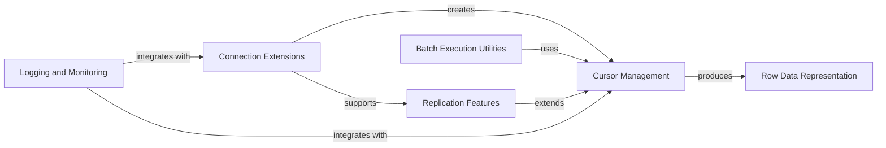

## Component Details

This graph represents the 'Advanced Cursor & Connection Features' subsystem, which extends basic database interaction with specialized cursor implementations for varied result formats, logging capabilities for monitoring database operations, and functionalities for PostgreSQL replication. The main flow involves connections creating specialized cursors, which in turn produce row data. Logging and batch execution utilities integrate with these core components, while replication features extend the connection and cursor functionalities.

### Cursor Management
This component provides various specialized cursor implementations for different data retrieval formats, including dictionary-like and named tuple results. It handles the creation and management of these cursors.

**Related Classes/Methods**:

- <a href="https://github.com/psycopg/psycopg2/blob/master/lib/extras.py#L65-L122" target="_blank" rel="noopener noreferrer">`psycopg2.lib.extras.DictCursorBase` (65:122)</a>
- <a href="https://github.com/psycopg/psycopg2/blob/master/lib/extras.py#L132-L157" target="_blank" rel="noopener noreferrer">`psycopg2.lib.extras.DictCursor` (132:157)</a>
- <a href="https://github.com/psycopg/psycopg2/blob/master/lib/extras.py#L221-L246" target="_blank" rel="noopener noreferrer">`psycopg2.lib.extras.RealDictCursor` (221:246)</a>
- <a href="https://github.com/psycopg/psycopg2/blob/master/lib/extras.py#L291-L376" target="_blank" rel="noopener noreferrer">`psycopg2.lib.extras.NamedTupleCursor` (291:376)</a>

### Connection Extensions
This component provides extended connection functionalities, including specialized connections for dictionary-like results, logging, and PostgreSQL replication.

**Related Classes/Methods**:

- <a href="https://github.com/psycopg/psycopg2/blob/master/lib/extras.py#L125-L129" target="_blank" rel="noopener noreferrer">`psycopg2.lib.extras.DictConnection` (125:129)</a>
- <a href="https://github.com/psycopg/psycopg2/blob/master/lib/extras.py#L214-L218" target="_blank" rel="noopener noreferrer">`psycopg2.lib.extras.RealDictConnection` (214:218)</a>
- <a href="https://github.com/psycopg/psycopg2/blob/master/lib/extras.py#L284-L288" target="_blank" rel="noopener noreferrer">`psycopg2.lib.extras.NamedTupleConnection` (284:288)</a>
- <a href="https://github.com/psycopg/psycopg2/blob/master/lib/extras.py#L389-L437" target="_blank" rel="noopener noreferrer">`psycopg2.lib.extras.LoggingConnection` (389:437)</a>
- <a href="https://github.com/psycopg/psycopg2/blob/master/lib/extras.py#L456-L481" target="_blank" rel="noopener noreferrer">`psycopg2.lib.extras.MinTimeLoggingConnection` (456:481)</a>
- <a href="https://github.com/psycopg/psycopg2/blob/master/lib/extras.py#L496-L500" target="_blank" rel="noopener noreferrer">`psycopg2.lib.extras.LogicalReplicationConnection` (496:500)</a>
- <a href="https://github.com/psycopg/psycopg2/blob/master/lib/extras.py#L503-L507" target="_blank" rel="noopener noreferrer">`psycopg2.lib.extras.PhysicalReplicationConnection` (503:507)</a>

### Row Data Representation
This component defines how individual rows of data are represented and accessed after being fetched from the database, primarily supporting dictionary-like access by column name.

**Related Classes/Methods**:

- <a href="https://github.com/psycopg/psycopg2/blob/master/lib/extras.py#L160-L211" target="_blank" rel="noopener noreferrer">`psycopg2.lib.extras.DictRow` (160:211)</a>
- <a href="https://github.com/psycopg/psycopg2/blob/master/lib/extras.py#L249-L281" target="_blank" rel="noopener noreferrer">`psycopg2.lib.extras.RealDictRow` (249:281)</a>

### Logging and Monitoring
This component provides capabilities for logging database interactions, including query execution details and performance metrics, allowing for monitoring and debugging.

**Related Classes/Methods**:

- <a href="https://github.com/psycopg/psycopg2/blob/master/lib/extras.py#L440-L453" target="_blank" rel="noopener noreferrer">`psycopg2.lib.extras.LoggingCursor` (440:453)</a>
- <a href="https://github.com/psycopg/psycopg2/blob/master/lib/extras.py#L484-L493" target="_blank" rel="noopener noreferrer">`psycopg2.lib.extras.MinTimeLoggingCursor` (484:493)</a>

### Replication Features
This component provides specialized cursor functionalities for PostgreSQL replication, enabling interaction with logical and physical replication streams.

**Related Classes/Methods**:

- <a href="https://github.com/psycopg/psycopg2/blob/master/lib/extras.py#L522-L621" target="_blank" rel="noopener noreferrer">`psycopg2.lib.extras.ReplicationCursor` (522:621)</a>

### Batch Execution Utilities
This component offers utility functions for efficient batch execution of SQL statements, reducing database roundtrips and improving performance for bulk operations.

**Related Classes/Methods**:

- <a href="https://github.com/psycopg/psycopg2/blob/master/lib/extras.py#L1194-L1216" target="_blank" rel="noopener noreferrer">`psycopg2.lib.extras.execute_batch` (1194:1216)</a>
- <a href="https://github.com/psycopg/psycopg2/blob/master/lib/extras.py#L1219-L1303" target="_blank" rel="noopener noreferrer">`psycopg2.lib.extras.execute_values` (1219:1303)</a>

### [FAQ](https://github.com/CodeBoarding/GeneratedOnBoardings/tree/main?tab=readme-ov-file#faq)