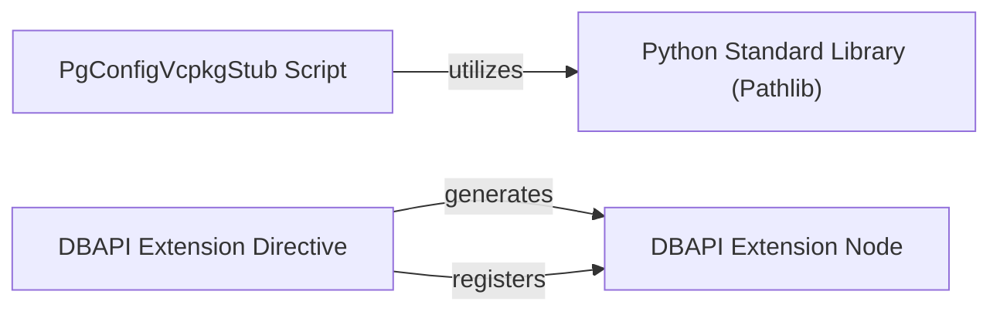

## Component Details

This graph outlines the structure and interactions of the 'Build & Documentation Utilities' component within the psycopg2 project. It encompasses a build-related utility for handling vcpkg configurations and a set of tools for generating documentation, specifically focusing on extensions to the DBAPI specification. The main flow involves the `PgConfigVcpkgStub Script` for build-time configuration and the `DBAPI Extension Directive` and `DBAPI Extension Node` for documentation generation, with the build script utilizing the `Python Standard Library (Pathlib)` for file system interactions.

### PgConfigVcpkgStub Script
This component is a script within the `psycopg2` build system, specifically designed to handle configuration related to `vcpkg`. It includes functions for parsing command-line arguments and robust error handling, and interacts with the file system.

**Related Classes/Methods**:

- `psycopg2.scripts.build.pg_config_vcpkg_stub.pg_config_vcpkg_stub._main` (full file reference)
- `psycopg2.scripts.build.pg_config_vcpkg_stub.pg_config_vcpkg_stub.main` (full file reference)
- `psycopg2.scripts.build.pg_config_vcpkg_stub.pg_config_vcpkg_stub.ScriptError` (full file reference)
- `psycopg2.scripts.build.pg_config_vcpkg_stub.pg_config_vcpkg_stub.parse_cmdline` (full file reference)

### DBAPI Extension Directive
This component is a Sphinx directive used in the `psycopg2` documentation. Its purpose is to create a visual admonition (a styled box) that clearly indicates when a specific feature or aspect of Psycopg extends beyond the standard Python DB-API 2.0 specification.

**Related Classes/Methods**:

- <a href="https://github.com/psycopg/psycopg2/blob/master/doc/src/tools/lib/dbapi_extension.py#L19-L35" target="_blank" rel="noopener noreferrer">`psycopg2.doc.src.tools.lib.dbapi_extension.Extension` (19:35)</a>
- <a href="https://github.com/psycopg/psycopg2/blob/master/doc/src/tools/lib/dbapi_extension.py#L30-L35" target="_blank" rel="noopener noreferrer">`psycopg2.doc.src.tools.lib.dbapi_extension.Extension:run` (30:35)</a>
- <a href="https://github.com/psycopg/psycopg2/blob/master/doc/src/tools/lib/dbapi_extension.py#L44-L50" target="_blank" rel="noopener noreferrer">`psycopg2.doc.src.tools.lib.dbapi_extension.setup` (44:50)</a>

### DBAPI Extension Node
This component represents the underlying Docutils node structure for the DB API extension admonition. It defines the visual and structural properties of the 'DB API extension' warning box within the Sphinx documentation.

**Related Classes/Methods**:

- <a href="https://github.com/psycopg/psycopg2/blob/master/doc/src/tools/lib/dbapi_extension.py#L16-L16" target="_blank" rel="noopener noreferrer">`psycopg2.doc.src.tools.lib.dbapi_extension.extension_node` (16:16)</a>
- <a href="https://github.com/psycopg/psycopg2/blob/master/doc/src/tools/lib/dbapi_extension.py#L38-L39" target="_blank" rel="noopener noreferrer">`psycopg2.doc.src.tools.lib.dbapi_extension.visit_extension_node` (38:39)</a>
- <a href="https://github.com/psycopg/psycopg2/blob/master/doc/src/tools/lib/dbapi_extension.py#L41-L42" target="_blank" rel="noopener noreferrer">`psycopg2.doc.src.tools.lib.dbapi_extension.depart_extension_node` (41:42)</a>

### Python Standard Library (Pathlib)
This represents the `pathlib` module from the Python standard library, which provides an object-oriented way to interact with file system paths.

**Related Classes/Methods**:

- `pathlib.Path` (full file reference)

### [FAQ](https://github.com/CodeBoarding/GeneratedOnBoardings/tree/main?tab=readme-ov-file#faq)