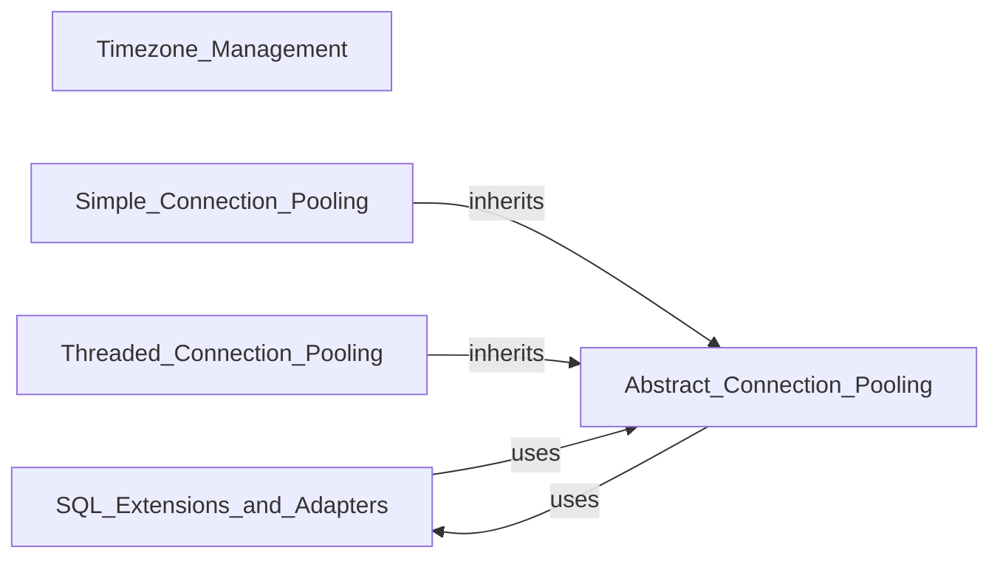

## Component Details

The Core Database Management component provides essential functionalities for interacting with PostgreSQL databases. It encompasses connection management through pooling, allowing for efficient reuse of database connections. It also includes extensions for handling SQL-specific operations like DSN string creation and adapting Python data types for SQL IN clauses. Furthermore, it offers utilities for managing timezones, ensuring correct handling of datetime objects in relation to database operations.

### Timezone_Management
Manages timezone information, including calculating UTC offsets, daylight saving time, and timezone names for both fixed offsets and local system timezones.

**Related Classes/Methods**:

- <a href="https://github.com/psycopg/psycopg2/blob/master/lib/tz.py#L36-L116" target="_blank" rel="noopener noreferrer">`psycopg2.lib.tz.FixedOffsetTimezone` (36:116)</a>
- <a href="https://github.com/psycopg/psycopg2/blob/master/lib/tz.py#L127-L153" target="_blank" rel="noopener noreferrer">`psycopg2.lib.tz.LocalTimezone` (127:153)</a>

### SQL_Extensions_and_Adapters
Provides extensions to the DBAPI-2.0, focusing on adapting Python data types for PostgreSQL, handling SQL IN clauses, and constructing DSN connection strings.

**Related Classes/Methods**:

- <a href="https://github.com/psycopg/psycopg2/blob/master/lib/extensions.py#L101-L122" target="_blank" rel="noopener noreferrer">`psycopg2.lib.extensions.SQL_IN` (101:122)</a>
- <a href="https://github.com/psycopg/psycopg2/blob/master/lib/extensions.py#L138-L169" target="_blank" rel="noopener noreferrer">`psycopg2.lib.extensions.make_dsn` (138:169)</a>
- <a href="https://github.com/psycopg/psycopg2/blob/master/lib/extensions.py#L172-L185" target="_blank" rel="noopener noreferrer">`psycopg2.lib.extensions._param_escape` (172:185)</a>
- <a href="https://github.com/psycopg/psycopg2/blob/master/lib/extensions.py#L95-L97" target="_blank" rel="noopener noreferrer">`psycopg2.lib.extensions.register_adapter` (95:97)</a>

### Abstract_Connection_Pooling
Implements the core logic for a generic, key-based connection pool, managing the creation, retrieval, and release of database connections. It handles the fundamental operations of connection management and error handling within the pool.

**Related Classes/Methods**:

- <a href="https://github.com/psycopg/psycopg2/blob/master/lib/pool.py#L32-L33" target="_blank" rel="noopener noreferrer">`psycopg2.lib.pool.PoolError` (32:33)</a>
- <a href="https://github.com/psycopg/psycopg2/blob/master/lib/pool.py#L36-L144" target="_blank" rel="noopener noreferrer">`psycopg2.lib.pool.AbstractConnectionPool` (36:144)</a>

### Simple_Connection_Pooling
Provides a basic, non-threaded connection pool implementation, extending the abstract connection pooling functionality for single-threaded environments.

**Related Classes/Methods**:

- <a href="https://github.com/psycopg/psycopg2/blob/master/lib/pool.py#L147-L152" target="_blank" rel="noopener noreferrer">`psycopg2.lib.pool.SimpleConnectionPool` (147:152)</a>

### Threaded_Connection_Pooling
Extends the abstract connection pooling functionality to provide a thread-safe connection pool, ensuring safe concurrent access to database connections in multi-threaded environments.

**Related Classes/Methods**:

- <a href="https://github.com/psycopg/psycopg2/blob/master/lib/pool.py#L155-L187" target="_blank" rel="noopener noreferrer">`psycopg2.lib.pool.ThreadedConnectionPool` (155:187)</a>

### [FAQ](https://github.com/CodeBoarding/GeneratedOnBoardings/tree/main?tab=readme-ov-file#faq)