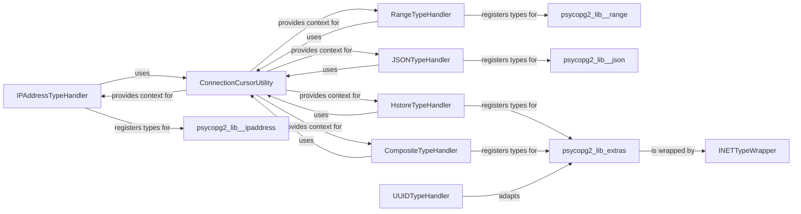

## Component Details

This component overview details the `Data Type Adapters` subsystem within `psycopg2`, which is crucial for enabling seamless data exchange between Python applications and PostgreSQL databases. It achieves this by adapting Python data types to their corresponding PostgreSQL-specific types and vice-versa. The subsystem is composed of several specialized handlers, each responsible for a particular data type family, such as IP addresses, range types, JSON/JSONB, hstore, composite types, and UUIDs. A central `ConnectionCursorUtility` facilitates the necessary database context for these handlers to register and perform type conversions.

### IPAddressTypeHandler
Manages the registration and conversion of PostgreSQL INET and CIDR data types to and from Python `ipaddress` objects. It registers type casters for INET and CIDR, and adapters for `IPv4Interface`, `IPv6Interface`, `IPv4Network`, and `IPv6Network` objects, ensuring proper handling of network address types.

**Related Classes/Methods**:

- <a href="https://github.com/psycopg/psycopg2/blob/master/lib/_ipaddress.py#L37-L63" target="_blank" rel="noopener noreferrer">`psycopg2.lib._ipaddress.register_ipaddress` (37:63)</a>
- <a href="https://github.com/psycopg/psycopg2/blob/master/lib/_ipaddress.py#L66-L73" target="_blank" rel="noopener noreferrer">`psycopg2.lib._ipaddress._make_casters` (66:73)</a>
- <a href="https://github.com/psycopg/psycopg2/blob/master/lib/_ipaddress.py#L76-L80" target="_blank" rel="noopener noreferrer">`psycopg2.lib._ipaddress.cast_interface` (76:80)</a>
- <a href="https://github.com/psycopg/psycopg2/blob/master/lib/_ipaddress.py#L83-L86" target="_blank" rel="noopener noreferrer">`psycopg2.lib._ipaddress.cast_network` (83:86)</a>
- <a href="https://github.com/psycopg/psycopg2/blob/master/lib/_ipaddress.py#L89-L90" target="_blank" rel="noopener noreferrer">`psycopg2.lib._ipaddress.adapt_ipaddress` (89:90)</a>

### RangeTypeHandler
Provides classes and functions for handling PostgreSQL range types, including their representation in Python and casting mechanisms for database interaction. It defines a generic `Range` class and specialized casters for numeric, date, datetime, and datetime with timezone ranges, facilitating seamless conversion between Python objects and PostgreSQL range strings.

**Related Classes/Methods**:

- <a href="https://github.com/psycopg/psycopg2/blob/master/lib/_range.py#L35-L203" target="_blank" rel="noopener noreferrer">`psycopg2.lib._range.Range` (35:203)</a>
- <a href="https://github.com/psycopg/psycopg2/blob/master/lib/_range.py#L206-L234" target="_blank" rel="noopener noreferrer">`psycopg2.lib._range.register_range` (206:234)</a>
- <a href="https://github.com/psycopg/psycopg2/blob/master/lib/_range.py#L237-L282" target="_blank" rel="noopener noreferrer">`psycopg2.lib._range.RangeAdapter` (237:282)</a>
- <a href="https://github.com/psycopg/psycopg2/blob/master/lib/_range.py#L285-L470" target="_blank" rel="noopener noreferrer">`psycopg2.lib._range.RangeCaster` (285:470)</a>
- <a href="https://github.com/psycopg/psycopg2/blob/master/lib/_range.py#L473-L479" target="_blank" rel="noopener noreferrer">`psycopg2.lib._range.NumericRange` (473:479)</a>
- <a href="https://github.com/psycopg/psycopg2/blob/master/lib/_range.py#L482-L484" target="_blank" rel="noopener noreferrer">`psycopg2.lib._range.DateRange` (482:484)</a>
- <a href="https://github.com/psycopg/psycopg2/blob/master/lib/_range.py#L487-L489" target="_blank" rel="noopener noreferrer">`psycopg2.lib._range.DateTimeRange` (487:489)</a>
- <a href="https://github.com/psycopg/psycopg2/blob/master/lib/_range.py#L492-L494" target="_blank" rel="noopener noreferrer">`psycopg2.lib._range.DateTimeTZRange` (492:494)</a>

### JSONTypeHandler
Manages the serialization and deserialization of JSON data, including the `Json` class for representing JSON values and functions for registering default JSON and JSONB type handlers. It provides mechanisms to convert Python objects to JSON strings for database storage and parse JSON strings from the database into Python objects.

**Related Classes/Methods**:

- <a href="https://github.com/psycopg/psycopg2/blob/master/lib/_json.py#L46-L86" target="_blank" rel="noopener noreferrer">`psycopg2.lib._json.Json` (46:86)</a>
- <a href="https://github.com/psycopg/psycopg2/blob/master/lib/_json.py#L89-L125" target="_blank" rel="noopener noreferrer">`psycopg2.lib._json.register_json` (89:125)</a>
- <a href="https://github.com/psycopg/psycopg2/blob/master/lib/_json.py#L128-L138" target="_blank" rel="noopener noreferrer">`psycopg2.lib._json.register_default_json` (128:138)</a>
- <a href="https://github.com/psycopg/psycopg2/blob/master/lib/_json.py#L141-L151" target="_blank" rel="noopener noreferrer">`psycopg2.lib._json.register_default_jsonb` (141:151)</a>
- <a href="https://github.com/psycopg/psycopg2/blob/master/lib/_json.py#L154-L170" target="_blank" rel="noopener noreferrer">`psycopg2.lib._json._create_json_typecasters` (154:170)</a>
- <a href="https://github.com/psycopg/psycopg2/blob/master/lib/_json.py#L173-L199" target="_blank" rel="noopener noreferrer">`psycopg2.lib._json._get_json_oids` (173:199)</a>

### HstoreTypeHandler
Handles the adaptation and parsing of PostgreSQL hstore data types. It provides functionality to convert Python dictionaries to hstore format and parse hstore strings into Python dictionaries, including retrieving necessary OIDs for type registration.

**Related Classes/Methods**:

- <a href="https://github.com/psycopg/psycopg2/blob/master/lib/extras.py#L788-L921" target="_blank" rel="noopener noreferrer">`psycopg2.lib.extras.HstoreAdapter` (788:921)</a>

### CompositeTypeHandler
Facilitates the conversion of PostgreSQL composite types into Python objects. It includes mechanisms for parsing composite type strings, tokenizing their components, and constructing Python objects based on the type's attributes, enabling structured data exchange.

**Related Classes/Methods**:

- <a href="https://github.com/psycopg/psycopg2/blob/master/lib/extras.py#L984-L1144" target="_blank" rel="noopener noreferrer">`psycopg2.lib.extras.CompositeCaster` (984:1144)</a>

### UUIDTypeHandler
Manages the adaptation of Python `UUID` objects to PostgreSQL UUID types for database storage. It provides an adapter to convert UUID objects into their string representation suitable for PostgreSQL.

**Related Classes/Methods**:

- <a href="https://github.com/psycopg/psycopg2/blob/master/lib/extras.py#L626-L644" target="_blank" rel="noopener noreferrer">`psycopg2.lib.extras.UUID_adapter` (626:644)</a>

### INETTypeWrapper
A wrapper class for PostgreSQL INET addresses, providing a Python object representation for INET values. It allows for easy manipulation and comparison of INET addresses within Python applications.

**Related Classes/Methods**:

- <a href="https://github.com/psycopg/psycopg2/blob/master/lib/extras.py#L681-L709" target="_blank" rel="noopener noreferrer">`psycopg2.lib.extras.Inet` (681:709)</a>

### ConnectionCursorUtility
A utility component responsible for resolving and providing valid connection and cursor objects from a given input. This ensures that type handling components have the correct database interaction context for registering types or performing operations that require a connection or cursor.

**Related Classes/Methods**:

- <a href="https://github.com/psycopg/psycopg2/blob/master/lib/extras.py#L773-L785" target="_blank" rel="noopener noreferrer">`psycopg2.lib.extras._solve_conn_curs` (773:785)</a>

### [FAQ](https://github.com/CodeBoarding/GeneratedOnBoardings/tree/main?tab=readme-ov-file#faq)