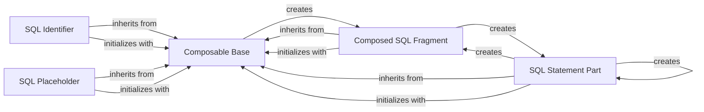

## Component Details

This component provides a safe and programmatic interface for building SQL queries, preventing SQL injection vulnerabilities through composable objects like SQL fragments, identifiers, and placeholders. The core idea is to represent different parts of an SQL query as distinct, composable Python objects, allowing for their safe combination and rendering into a final SQL string.

### Composable Base
The abstract base class for all SQL composition objects. It provides fundamental methods for combining SQL parts using operators like '+' and '*' and defines the interface for converting objects to their string representation (`as_string`).

**Related Classes/Methods**:

- <a href="https://github.com/psycopg/psycopg2/blob/master/lib/sql.py#L35-L83" target="_blank" rel="noopener noreferrer">`psycopg2.lib.sql.Composable` (35:83)</a>
- <a href="https://github.com/psycopg/psycopg2/blob/master/lib/sql.py#L49-L50" target="_blank" rel="noopener noreferrer">`psycopg2.lib.sql.Composable:__init__` (49:50)</a>
- <a href="https://github.com/psycopg/psycopg2/blob/master/lib/sql.py#L68-L74" target="_blank" rel="noopener noreferrer">`psycopg2.lib.sql.Composable:__add__` (68:74)</a>
- <a href="https://github.com/psycopg/psycopg2/blob/master/lib/sql.py#L76-L77" target="_blank" rel="noopener noreferrer">`psycopg2.lib.sql.Composable:__mul__` (76:77)</a>
- <a href="https://github.com/psycopg/psycopg2/blob/master/lib/sql.py#L79-L80" target="_blank" rel="noopener noreferrer">`psycopg2.lib.sql.Composable:__eq__` (79:80)</a>
- <a href="https://github.com/psycopg/psycopg2/blob/master/lib/sql.py#L82-L83" target="_blank" rel="noopener noreferrer">`psycopg2.lib.sql.Composable:__ne__` (82:83)</a>

### Composed SQL Fragment
A concrete implementation of `Composable Base` that represents a sequence of other `Composable` objects. It allows for the concatenation and joining of multiple SQL components into a single, larger SQL string. This component is typically created through operations on `Composable` objects.

**Related Classes/Methods**:

- <a href="https://github.com/psycopg/psycopg2/blob/master/lib/sql.py#L86-L156" target="_blank" rel="noopener noreferrer">`psycopg2.lib.sql.Composed` (86:156)</a>
- <a href="https://github.com/psycopg/psycopg2/blob/master/lib/sql.py#L104-L112" target="_blank" rel="noopener noreferrer">`psycopg2.lib.sql.Composed:__init__` (104:112)</a>
- <a href="https://github.com/psycopg/psycopg2/blob/master/lib/sql.py#L128-L134" target="_blank" rel="noopener noreferrer">`psycopg2.lib.sql.Composed:__add__` (128:134)</a>
- <a href="https://github.com/psycopg/psycopg2/blob/master/lib/sql.py#L136-L156" target="_blank" rel="noopener noreferrer">`psycopg2.lib.sql.Composed:join` (136:156)</a>

### SQL Statement Part
Represents a literal snippet of an SQL statement. Unlike identifiers or placeholders, its content is not escaped. It provides powerful `format()` and `join()` methods to dynamically construct SQL queries by embedding other `Composable` objects.

**Related Classes/Methods**:

- <a href="https://github.com/psycopg/psycopg2/blob/master/lib/sql.py#L159-L287" target="_blank" rel="noopener noreferrer">`psycopg2.lib.sql.SQL` (159:287)</a>
- <a href="https://github.com/psycopg/psycopg2/blob/master/lib/sql.py#L181-L184" target="_blank" rel="noopener noreferrer">`psycopg2.lib.sql.SQL:__init__` (181:184)</a>
- <a href="https://github.com/psycopg/psycopg2/blob/master/lib/sql.py#L194-L256" target="_blank" rel="noopener noreferrer">`psycopg2.lib.sql.SQL:format` (194:256)</a>
- <a href="https://github.com/psycopg/psycopg2/blob/master/lib/sql.py#L258-L287" target="_blank" rel="noopener noreferrer">`psycopg2.lib.sql.SQL:join` (258:287)</a>

### SQL Identifier
Represents an SQL identifier, such as a table name or column name. This component ensures that the identifier is correctly quoted according to PostgreSQL's rules, preventing SQL injection vulnerabilities when dealing with dynamic object names.

**Related Classes/Methods**:

- <a href="https://github.com/psycopg/psycopg2/blob/master/lib/sql.py#L290-L350" target="_blank" rel="noopener noreferrer">`psycopg2.lib.sql.Identifier` (290:350)</a>
- <a href="https://github.com/psycopg/psycopg2/blob/master/lib/sql.py#L321-L329" target="_blank" rel="noopener noreferrer">`psycopg2.lib.sql.Identifier:__init__` (321:329)</a>

### SQL Placeholder
Represents a placeholder for query parameters within an SQL statement. It can generate either positional (`%s`) or named (`%(name)s`) placeholders, facilitating the creation of parameterized queries with varying numbers of arguments.

**Related Classes/Methods**:

- <a href="https://github.com/psycopg/psycopg2/blob/master/lib/sql.py#L398-L450" target="_blank" rel="noopener noreferrer">`psycopg2.lib.sql.Placeholder` (398:450)</a>
- <a href="https://github.com/psycopg/psycopg2/blob/master/lib/sql.py#L425-L433" target="_blank" rel="noopener noreferrer">`psycopg2.lib.sql.Placeholder:__init__` (425:433)</a>

### [FAQ](https://github.com/CodeBoarding/GeneratedOnBoardings/tree/main?tab=readme-ov-file#faq)