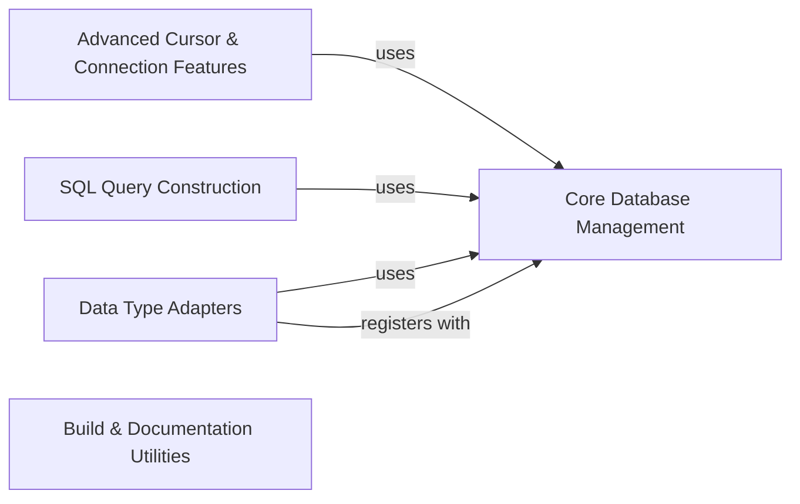

## Component Details

The psycopg2 library provides a comprehensive interface for interacting with PostgreSQL databases from Python. Its architecture is modular, separating core connection and extension management from specialized data type handling, SQL query construction, and advanced cursor features. This design allows for efficient database operations, robust type conversions, and secure query building, while also including utilities for build processes and documentation generation.

### Core Database Management
This component provides the foundational functionalities for managing database connections, including connection pooling for efficient resource reuse, and core extensions for DSN string creation and SQL IN clause handling. It also includes utilities for timezone management.

**Related Classes/Methods**:

- <a href="https://github.com/psycopg/psycopg2/blob/master/lib/pool.py#L32-L33" target="_blank" rel="noopener noreferrer">`psycopg2.lib.pool.PoolError` (32:33)</a>
- <a href="https://github.com/psycopg/psycopg2/blob/master/lib/pool.py#L36-L144" target="_blank" rel="noopener noreferrer">`psycopg2.lib.pool.AbstractConnectionPool` (36:144)</a>
- <a href="https://github.com/psycopg/psycopg2/blob/master/lib/pool.py#L147-L152" target="_blank" rel="noopener noreferrer">`psycopg2.lib.pool.SimpleConnectionPool` (147:152)</a>
- <a href="https://github.com/psycopg/psycopg2/blob/master/lib/pool.py#L155-L187" target="_blank" rel="noopener noreferrer">`psycopg2.lib.pool.ThreadedConnectionPool` (155:187)</a>
- <a href="https://github.com/psycopg/psycopg2/blob/master/lib/extensions.py#L101-L122" target="_blank" rel="noopener noreferrer">`psycopg2.lib.extensions.SQL_IN` (101:122)</a>
- <a href="https://github.com/psycopg/psycopg2/blob/master/lib/extensions.py#L138-L169" target="_blank" rel="noopener noreferrer">`psycopg2.lib.extensions.make_dsn` (138:169)</a>
- <a href="https://github.com/psycopg/psycopg2/blob/master/lib/extensions.py#L172-L185" target="_blank" rel="noopener noreferrer">`psycopg2.lib.extensions._param_escape` (172:185)</a>
- <a href="https://github.com/psycopg/psycopg2/blob/master/lib/extensions.py#L95-L97" target="_blank" rel="noopener noreferrer">`psycopg2.lib.extensions.register_adapter` (95:97)</a>
- <a href="https://github.com/psycopg/psycopg2/blob/master/lib/tz.py#L36-L116" target="_blank" rel="noopener noreferrer">`psycopg2.lib.tz.FixedOffsetTimezone` (36:116)</a>
- <a href="https://github.com/psycopg/psycopg2/blob/master/lib/tz.py#L127-L153" target="_blank" rel="noopener noreferrer">`psycopg2.lib.tz.LocalTimezone` (127:153)</a>

### Data Type Adapters
This component is responsible for adapting Python data types to PostgreSQL-specific types and vice-versa, ensuring seamless data exchange. It includes specialized handlers for IP addresses, range types, JSON/JSONB, hstore, composite types, and UUIDs.

**Related Classes/Methods**:

- <a href="https://github.com/psycopg/psycopg2/blob/master/lib/_ipaddress.py#L37-L63" target="_blank" rel="noopener noreferrer">`psycopg2.lib._ipaddress.register_ipaddress` (37:63)</a>
- <a href="https://github.com/psycopg/psycopg2/blob/master/lib/_ipaddress.py#L66-L73" target="_blank" rel="noopener noreferrer">`psycopg2.lib._ipaddress._make_casters` (66:73)</a>
- <a href="https://github.com/psycopg/psycopg2/blob/master/lib/_ipaddress.py#L76-L80" target="_blank" rel="noopener noreferrer">`psycopg2.lib._ipaddress.cast_interface` (76:80)</a>
- <a href="https://github.com/psycopg/psycopg2/blob/master/lib/_ipaddress.py#L83-L86" target="_blank" rel="noopener noreferrer">`psycopg2.lib._ipaddress.cast_network` (83:86)</a>
- <a href="https://github.com/psycopg/psycopg2/blob/master/lib/_ipaddress.py#L89-L90" target="_blank" rel="noopener noreferrer">`psycopg2.lib._ipaddress.adapt_ipaddress` (89:90)</a>
- <a href="https://github.com/psycopg/psycopg2/blob/master/lib/_range.py#L35-L203" target="_blank" rel="noopener noreferrer">`psycopg2.lib._range.Range` (35:203)</a>
- <a href="https://github.com/psycopg/psycopg2/blob/master/lib/_range.py#L206-L234" target="_blank" rel="noopener noreferrer">`psycopg2.lib._range.register_range` (206:234)</a>
- <a href="https://github.com/psycopg/psycopg2/blob/master/lib/_range.py#L237-L282" target="_blank" rel="noopener noreferrer">`psycopg2.lib._range.RangeAdapter` (237:282)</a>
- <a href="https://github.com/psycopg/psycopg2/blob/master/lib/_range.py#L285-L470" target="_blank" rel="noopener noreferrer">`psycopg2.lib._range.RangeCaster` (285:470)</a>
- <a href="https://github.com/psycopg/psycopg2/blob/master/lib/_range.py#L473-L479" target="_blank" rel="noopener noreferrer">`psycopg2.lib._range.NumericRange` (473:479)</a>
- <a href="https://github.com/psycopg/psycopg2/blob/master/lib/_range.py#L482-L484" target="_blank" rel="noopener noreferrer">`psycopg2.lib._range.DateRange` (482:484)</a>
- <a href="https://github.com/psycopg/psycopg2/blob/master/lib/_range.py#L487-L489" target="_blank" rel="noopener noreferrer">`psycopg2.lib._range.DateTimeRange` (487:489)</a>
- <a href="https://github.com/psycopg/psycopg2/blob/master/lib/_range.py#L492-L494" target="_blank" rel="noopener noreferrer">`psycopg2.lib._range.DateTimeTZRange` (492:494)</a>
- <a href="https://github.com/psycopg/psycopg2/blob/master/lib/_json.py#L46-L86" target="_blank" rel="noopener noreferrer">`psycopg2.lib._json.Json` (46:86)</a>
- <a href="https://github.com/psycopg/psycopg2/blob/master/lib/_json.py#L89-L125" target="_blank" rel="noopener noreferrer">`psycopg2.lib._json.register_json` (89:125)</a>
- <a href="https://github.com/psycopg/psycopg2/blob/master/lib/_json.py#L128-L138" target="_blank" rel="noopener noreferrer">`psycopg2.lib._json.register_default_json` (128:138)</a>
- <a href="https://github.com/psycopg/psycopg2/blob/master/lib/_json.py#L141-L151" target="_blank" rel="noopener noreferrer">`psycopg2.lib._json.register_default_jsonb` (141:151)</a>
- <a href="https://github.com/psycopg/psycopg2/blob/master/lib/_json.py#L154-L170" target="_blank" rel="noopener noreferrer">`psycopg2.lib._json._create_json_typecasters` (154:170)</a>
- <a href="https://github.com/psycopg/psycopg2/blob/master/lib/_json.py#L173-L199" target="_blank" rel="noopener noreferrer">`psycopg2.lib._json._get_json_oids` (173:199)</a>
- <a href="https://github.com/psycopg/psycopg2/blob/master/lib/extras.py#L788-L921" target="_blank" rel="noopener noreferrer">`psycopg2.lib.extras.HstoreAdapter` (788:921)</a>
- <a href="https://github.com/psycopg/psycopg2/blob/master/lib/extras.py#L984-L1144" target="_blank" rel="noopener noreferrer">`psycopg2.lib.extras.CompositeCaster` (984:1144)</a>
- <a href="https://github.com/psycopg/psycopg2/blob/master/lib/extras.py#L626-L644" target="_blank" rel="noopener noreferrer">`psycopg2.lib.extras.UUID_adapter` (626:644)</a>
- <a href="https://github.com/psycopg/psycopg2/blob/master/lib/extras.py#L681-L709" target="_blank" rel="noopener noreferrer">`psycopg2.lib.extras.Inet` (681:709)</a>

### SQL Query Construction
This component provides a safe and programmatic interface for building SQL queries, preventing SQL injection vulnerabilities through composable objects like SQL fragments, identifiers, and placeholders.

**Related Classes/Methods**:

- <a href="https://github.com/psycopg/psycopg2/blob/master/lib/sql.py#L35-L83" target="_blank" rel="noopener noreferrer">`psycopg2.lib.sql.Composable` (35:83)</a>
- <a href="https://github.com/psycopg/psycopg2/blob/master/lib/sql.py#L86-L156" target="_blank" rel="noopener noreferrer">`psycopg2.lib.sql.Composed` (86:156)</a>
- <a href="https://github.com/psycopg/psycopg2/blob/master/lib/sql.py#L159-L287" target="_blank" rel="noopener noreferrer">`psycopg2.lib.sql.SQL` (159:287)</a>
- <a href="https://github.com/psycopg/psycopg2/blob/master/lib/sql.py#L290-L350" target="_blank" rel="noopener noreferrer">`psycopg2.lib.sql.Identifier` (290:350)</a>
- <a href="https://github.com/psycopg/psycopg2/blob/master/lib/sql.py#L398-L450" target="_blank" rel="noopener noreferrer">`psycopg2.lib.sql.Placeholder` (398:450)</a>

### Advanced Cursor & Connection Features
This component extends basic database interaction with specialized cursor implementations (e.g., DictCursor, NamedTupleCursor) for varied result formats, logging capabilities for monitoring database operations, and functionalities for PostgreSQL replication.

**Related Classes/Methods**:

- <a href="https://github.com/psycopg/psycopg2/blob/master/lib/extras.py#L65-L122" target="_blank" rel="noopener noreferrer">`psycopg2.lib.extras.DictCursorBase` (65:122)</a>
- <a href="https://github.com/psycopg/psycopg2/blob/master/lib/extras.py#L125-L129" target="_blank" rel="noopener noreferrer">`psycopg2.lib.extras.DictConnection` (125:129)</a>
- <a href="https://github.com/psycopg/psycopg2/blob/master/lib/extras.py#L132-L157" target="_blank" rel="noopener noreferrer">`psycopg2.lib.extras.DictCursor` (132:157)</a>
- <a href="https://github.com/psycopg/psycopg2/blob/master/lib/extras.py#L160-L211" target="_blank" rel="noopener noreferrer">`psycopg2.lib.extras.DictRow` (160:211)</a>
- <a href="https://github.com/psycopg/psycopg2/blob/master/lib/extras.py#L214-L218" target="_blank" rel="noopener noreferrer">`psycopg2.lib.extras.RealDictConnection` (214:218)</a>
- <a href="https://github.com/psycopg/psycopg2/blob/master/lib/extras.py#L221-L246" target="_blank" rel="noopener noreferrer">`psycopg2.lib.extras.RealDictCursor` (221:246)</a>
- <a href="https://github.com/psycopg/psycopg2/blob/master/lib/extras.py#L249-L281" target="_blank" rel="noopener noreferrer">`psycopg2.lib.extras.RealDictRow` (249:281)</a>
- <a href="https://github.com/psycopg/psycopg2/blob/master/lib/extras.py#L284-L288" target="_blank" rel="noopener noreferrer">`psycopg2.lib.extras.NamedTupleConnection` (284:288)</a>
- <a href="https://github.com/psycopg/psycopg2/blob/master/lib/extras.py#L291-L376" target="_blank" rel="noopener noreferrer">`psycopg2.lib.extras.NamedTupleCursor` (291:376)</a>
- <a href="https://github.com/psycopg/psycopg2/blob/master/lib/extras.py#L389-L437" target="_blank" rel="noopener noreferrer">`psycopg2.lib.extras.LoggingConnection` (389:437)</a>
- <a href="https://github.com/psycopg/psycopg2/blob/master/lib/extras.py#L440-L453" target="_blank" rel="noopener noreferrer">`psycopg2.lib.extras.LoggingCursor` (440:453)</a>
- <a href="https://github.com/psycopg/psycopg2/blob/master/lib/extras.py#L456-L481" target="_blank" rel="noopener noreferrer">`psycopg2.lib.extras.MinTimeLoggingConnection` (456:481)</a>
- <a href="https://github.com/psycopg/psycopg2/blob/master/lib/extras.py#L484-L493" target="_blank" rel="noopener noreferrer">`psycopg2.lib.extras.MinTimeLoggingCursor` (484:493)</a>
- <a href="https://github.com/psycopg/psycopg2/blob/master/lib/extras.py#L496-L500" target="_blank" rel="noopener noreferrer">`psycopg2.lib.extras.LogicalReplicationConnection` (496:500)</a>
- <a href="https://github.com/psycopg/psycopg2/blob/master/lib/extras.py#L503-L507" target="_blank" rel="noopener noreferrer">`psycopg2.lib.extras.PhysicalReplicationConnection` (503:507)</a>
- <a href="https://github.com/psycopg/psycopg2/blob/master/lib/extras.py#L522-L621" target="_blank" rel="noopener noreferrer">`psycopg2.lib.extras.ReplicationCursor` (522:621)</a>
- <a href="https://github.com/psycopg/psycopg2/blob/master/lib/extras.py#L1194-L1216" target="_blank" rel="noopener noreferrer">`psycopg2.lib.extras.execute_batch` (1194:1216)</a>
- <a href="https://github.com/psycopg/psycopg2/blob/master/lib/extras.py#L1219-L1303" target="_blank" rel="noopener noreferrer">`psycopg2.lib.extras.execute_values` (1219:1303)</a>

### Build & Documentation Utilities
This component provides auxiliary functionalities for the psycopg2 project, including build-related utilities like a stub for pg_config_vcpkg and tools for generating documentation, particularly for DBAPI extensions.

**Related Classes/Methods**:

- `psycopg2.scripts.build.pg_config_vcpkg_stub.pg_config_vcpkg_stub:_main` (full file reference)
- `psycopg2.scripts.build.pg_config_vcpkg_stub.pg_config_vcpkg_stub.ScriptError` (full file reference)
- `psycopg2.scripts.build.pg_config_vcpkg_stub.pg_config_vcpkg_stub.parse_cmdline` (full file reference)
- `psycopg2.scripts.build.pg_config_vcpkg_stub.pg_config_vcpkg_stub:main` (full file reference)
- <a href="https://github.com/psycopg/psycopg2/blob/master/doc/src/tools/lib/dbapi_extension.py#L16-L16" target="_blank" rel="noopener noreferrer">`psycopg2.doc.src.tools.lib.dbapi_extension.extension_node` (16:16)</a>
- <a href="https://github.com/psycopg/psycopg2/blob/master/doc/src/tools/lib/dbapi_extension.py#L19-L35" target="_blank" rel="noopener noreferrer">`psycopg2.doc.src.tools.lib.dbapi_extension.Extension` (19:35)</a>
- <a href="https://github.com/psycopg/psycopg2/blob/master/doc/src/tools/lib/dbapi_extension.py#L30-L35" target="_blank" rel="noopener noreferrer">`psycopg2.doc.src.tools.lib.dbapi_extension.Extension:run` (30:35)</a>
- <a href="https://github.com/psycopg/psycopg2/blob/master/doc/src/tools/lib/dbapi_extension.py#L38-L39" target="_blank" rel="noopener noreferrer">`psycopg2.doc.src.tools.lib.dbapi_extension.visit_extension_node` (38:39)</a>
- <a href="https://github.com/psycopg/psycopg2/blob/master/doc/src/tools/lib/dbapi_extension.py#L41-L42" target="_blank" rel="noopener noreferrer">`psycopg2.doc.src.tools.lib.dbapi_extension.depart_extension_node` (41:42)</a>
- <a href="https://github.com/psycopg/psycopg2/blob/master/doc/src/tools/lib/dbapi_extension.py#L44-L50" target="_blank" rel="noopener noreferrer">`psycopg2.doc.src.tools.lib.dbapi_extension.setup` (44:50)</a>

### [FAQ](https://github.com/CodeBoarding/GeneratedOnBoardings/tree/main?tab=readme-ov-file#faq)