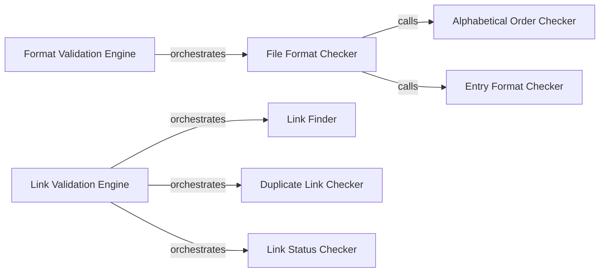

## Component Details

### Format Validation Engine
The Format Validation Engine is responsible for checking the format of the API list data file. It includes checks for alphabetical order of categories and the format of individual API entries, ensuring that the data adheres to predefined standards. It aggregates all format-related error messages.
- **Related Classes/Methods**: `repos.public-apis.scripts.validate.format.main`

### Link Validation Engine
The Link Validation Engine is responsible for validating the links in the API list data file. It finds links, checks for duplicates, and verifies if the links are working by making HTTP requests. It handles exceptions like SSL errors and timeouts, and it uses a fake user agent to avoid being blocked. It aggregates all link-related error messages.
- **Related Classes/Methods**: `repos.public-apis.scripts.validate.links.main`

### File Format Checker
The File Format Checker checks the overall format of the data file. It calls functions to check alphabetical order of categories, and the format of each entry. It aggregates and returns all error messages.
- **Related Classes/Methods**: `repos.public-apis.scripts.validate.format.check_file_format`

### Alphabetical Order Checker
The Alphabetical Order Checker verifies that the categories within the data file are in alphabetical order. It extracts category names and their line numbers, then compares the sorted list with the original. Returns a list of error messages if any category is out of order.
- **Related Classes/Methods**: `repos.public-apis.scripts.validate.format.check_alphabetical_order`

### Entry Format Checker
The Entry Format Checker validates the format of a single API entry within a category. It calls functions to check the title, description, auth, HTTPS, and CORS fields of the entry. It aggregates and returns all error messages related to the entry.
- **Related Classes/Methods**: `repos.public-apis.scripts.validate.format.check_entry`

### Link Finder
The Link Finder component is responsible for extracting all links from the data file. It reads the file content, extracts the relevant section, and uses regular expressions to identify the URLs.
- **Related Classes/Methods**: `repos.public-apis.scripts.validate.links.find_links_in_file`, `repos.public-apis.scripts.validate.links.find_links_in_text`

### Duplicate Link Checker
The Duplicate Link Checker identifies duplicate links within the extracted list of links. It iterates through the list, keeping track of seen links, and returns a list of the duplicate links.
- **Related Classes/Methods**: `repos.public-apis.scripts.validate.links.check_duplicate_links`

### Link Status Checker
The Link Status Checker verifies the status of each link by sending an HTTP request and checking the response. It handles exceptions such as SSL errors, connection errors, and timeouts. It returns an error message if a link is not working.
- **Related Classes/Methods**: `repos.public-apis.scripts.validate.links.check_if_link_is_working`
