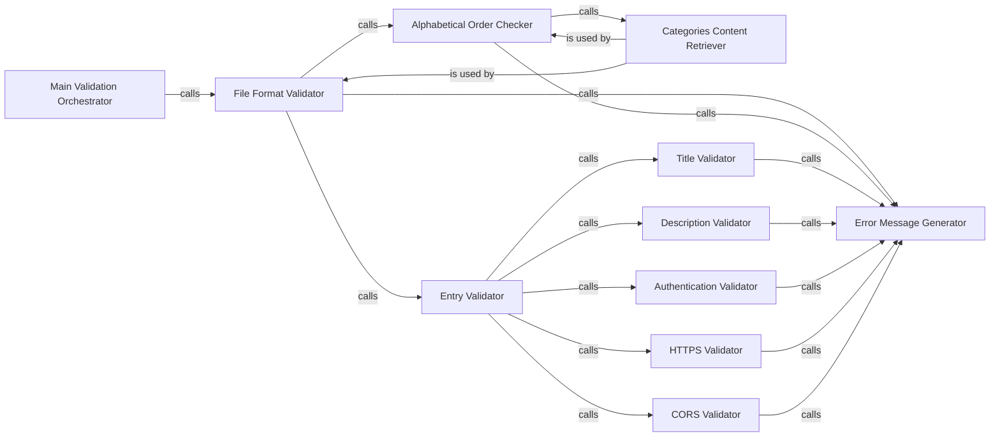

## Component Details

### Main Validation Orchestrator
The main function that orchestrates the entire format validation process. It initializes the validation by calling `check_file_format` to validate the overall structure and entries within the data file.
- **Related Classes/Methods**: `repos.public-apis.scripts.validate.format:main`

### File Format Validator
This component validates the overall format of the data file. It checks if the categories are in alphabetical order and then iterates through each entry, validating them individually using the `check_entry` component. It relies on `get_categories_content` to retrieve the categories and their line numbers.
- **Related Classes/Methods**: `repos.public-apis.scripts.validate.format:check_file_format`

### Entry Validator
This component is responsible for validating a single entry within the data file. It calls specific validation functions to check the title, description, authentication type, HTTPS status, and CORS support for each entry.
- **Related Classes/Methods**: `repos.public-apis.scripts.validate.format:check_entry`

### Alphabetical Order Checker
This component checks whether the categories within the data file are arranged in alphabetical order. It uses the `get_categories_content` component to retrieve the categories for comparison.
- **Related Classes/Methods**: `repos.public-apis.scripts.validate.format:check_alphabetical_order`

### Categories Content Retriever
This component retrieves the content of categories from the data file, parsing the file to extract categories and their associated entries. It also stores the line number of each category for error reporting.
- **Related Classes/Methods**: `repos.public-apis.scripts.validate.format.get_categories_content`

### Title Validator
This component validates the format and content of the title field of an API entry.
- **Related Classes/Methods**: `repos.public-apis.scripts.validate.format:check_title`

### Description Validator
This component validates the format and content of the description field of an API entry.
- **Related Classes/Methods**: `repos.public-apis.scripts.validate.format:check_description`

### Authentication Validator
This component validates the authentication type specified for an API entry.
- **Related Classes/Methods**: `repos.public-apis.scripts.validate.format:check_auth`

### HTTPS Validator
This component validates whether an API entry supports HTTPS.
- **Related Classes/Methods**: `repos.public-apis.scripts.validate.format:check_https`

### CORS Validator
This component validates the CORS support status of an API entry.
- **Related Classes/Methods**: `repos.public-apis.scripts.validate.format:check_cors`

### Error Message Generator
This component generates detailed error messages, including the line number, to pinpoint formatting inconsistencies found during validation.
- **Related Classes/Methods**: `repos.public-apis.scripts.validate.format.error_message`
