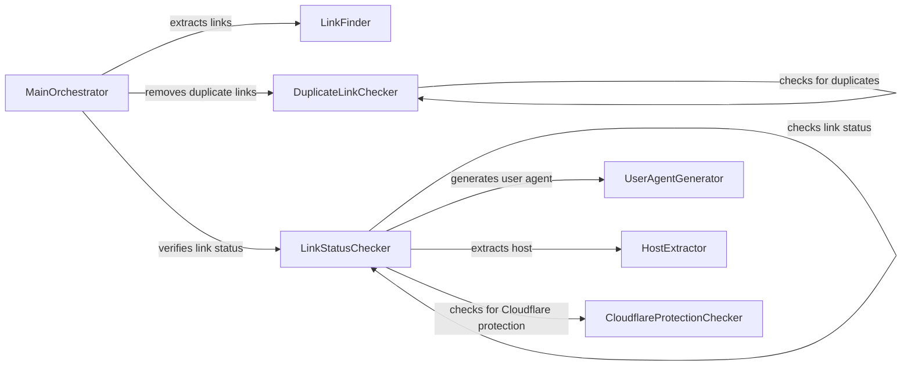

## Component Details

### LinkFinder
The LinkFinder component is responsible for extracting URLs from text or files. It uses regular expressions to identify potential links within the input data. This component provides the initial set of links that are then passed to other components for validation.
- **Related Classes/Methods**: `repos.public-apis.scripts.validate.links:find_links_in_text`, `repos.public-apis.scripts.validate.links:find_links_in_file`

### DuplicateLinkChecker
The DuplicateLinkChecker component identifies and removes duplicate URLs from a list of links. This ensures that each link is only validated once, improving efficiency and preventing redundant checks. It takes a list of URLs as input and returns a list of unique URLs.
- **Related Classes/Methods**: `repos.public-apis.scripts.validate.links:check_duplicate_links`, `repos.public-apis.scripts.validate.links:start_duplicate_links_checker`

### LinkStatusChecker
The LinkStatusChecker component verifies the status of individual URLs by sending HTTP requests. It checks for various errors, including SSL errors, connection errors, timeouts, and Cloudflare protection. This component determines whether a link is active and accessible.
- **Related Classes/Methods**: `repos.public-apis.scripts.validate.links:check_if_link_is_working`, `repos.public-apis.scripts.validate.links:check_if_list_of_links_are_working`, `repos.public-apis.scripts.validate.links:start_links_working_checker`

### CloudflareProtectionChecker
The CloudflareProtectionChecker component detects whether a given URL is protected by Cloudflare. It analyzes the HTTP response status code, headers, and content to identify Cloudflare's protection mechanisms. This allows the LinkStatusChecker to handle Cloudflare-protected links appropriately.
- **Related Classes/Methods**: `repos.public-apis.scripts.validate.links:has_cloudflare_protection`

### UserAgentGenerator
The UserAgentGenerator component generates fake user agent strings. This helps to avoid being blocked by hosting services that may restrict access based on user agent. The generated user agent is used by the LinkStatusChecker when sending HTTP requests.
- **Related Classes/Methods**: `repos.public-apis.scripts.validate.links:fake_user_agent`

### HostExtractor
The HostExtractor component extracts the host from a given URL. This information can be used for various purposes, such as identifying the server hosting the link or grouping links by host. The LinkStatusChecker uses this component.
- **Related Classes/Methods**: `repos.public-apis.scripts.validate.links:get_host_from_link`

### MainOrchestrator
The MainOrchestrator component coordinates the entire link validation process. It calls the LinkFinder to extract links, the DuplicateLinkChecker to remove duplicates, and the LinkStatusChecker to verify the status of each link. This component provides the overall control flow for the link validation engine.
- **Related Classes/Methods**: `repos.public-apis.scripts.validate.links:main`
