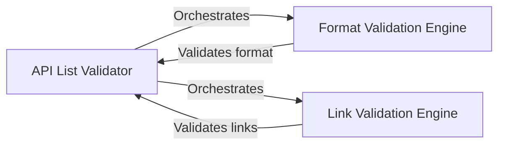

## Component Details

### API List Validator
This component acts as the central orchestrator for validating the API list. It integrates the Format Validation Engine and the Link Validation Engine to ensure the API entries adhere to predefined standards. It determines the overall validity of the API list based on the results of its sub-components, providing a single point of entry for the validation process.
- **Related Classes/Methods**: `repos.public-apis.scripts.validate.format.main`, `repos.public-apis.scripts.validate.links.main`

### Format Validation Engine
This component focuses on validating the format of the API entries. It performs checks for alphabetical order, title format, description format, authentication type, HTTPS usage, and CORS support. The engine generates detailed error messages to pinpoint any formatting inconsistencies, ensuring the API list maintains a consistent and well-structured format.
- **Related Classes/Methods**: `repos.public-apis.scripts.validate.format.check_alphabetical_order`, `repos.public-apis.scripts.validate.format.check_title`, `repos.public-apis.scripts.validate.format.check_description`, `repos.public-apis.scripts.validate.format.check_auth`, `repos.public-apis.scripts.validate.format.check_https`, `repos.public-apis.scripts.validate.format.check_cors`, `repos.public-apis.scripts.validate.format.check_entry`, `repos.public-apis.scripts.validate.format.check_file_format`, `repos.public-apis.scripts.validate.format.get_categories_content`, `repos.public-apis.scripts.validate.format.error_message`

### Link Validation Engine
This component is dedicated to validating the links within the API list. It verifies that the links are active, unique, and handles potential Cloudflare protection mechanisms. The engine provides a comprehensive assessment of link validity, ensuring that all links are functional and reliable.
- **Related Classes/Methods**: `repos.public-apis.scripts.validate.links.find_links_in_file`, `repos.public-apis.scripts.validate.links.find_links_in_text`, `repos.public-apis.scripts.validate.links.check_if_link_is_working`, `repos.public-apis.scripts.validate.links.check_if_list_of_links_are_working`, `repos.public-apis.scripts.validate.links.start_links_working_checker`, `repos.public-apis.scripts.validate.links.fake_user_agent`, `repos.public-apis.scripts.validate.links.get_host_from_link`, `repos.public-apis.scripts.validate.links.has_cloudflare_protection`, `repos.public-apis.scripts.validate.links.start_duplicate_links_checker`, `repos.public-apis.scripts.validate.links.check_duplicate_links`