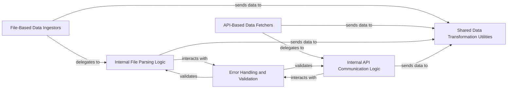

## Details

The `Data Input/Output (IO)` subsystem is a critical part of `pvlib-python`, responsible for ingesting diverse meteorological and PV system data. It adheres to the project's architectural bias towards a modular, functional design, providing clear interfaces for data acquisition while encapsulating the complexities of various data formats and external APIs.

### File-Based Data Ingestors
This component aggregates the functionality for reading and initially structuring meteorological and PV system data from various local file formats, such as EnergyPlus Weather (EPW), Typical Meteorological Year (TMY), Photovoltaic Array Network Operations Data (PANOND), and file-based aspects of Baseline Surface Radiation Network (BSRN) and Measurement and Instrumentation Data Center (MIDC) data. It acts as a facade for specific file parsing logic.

**Related Classes/Methods**:

- <a href="https://github.com/pvlib/pvlib-python/blob/main/pvlib/iotools/epw.py" target="_blank" rel="noopener noreferrer">`pvlib.iotools.epw`</a>
- <a href="https://github.com/pvlib/pvlib-python/blob/main/pvlib/iotools/tmy.py" target="_blank" rel="noopener noreferrer">`pvlib.iotools.tmy`</a>
- <a href="https://github.com/pvlib/pvlib-python/blob/main/pvlib/iotools/panond.py" target="_blank" rel="noopener noreferrer">`pvlib.iotools.panond`</a>
- <a href="https://github.com/pvlib/pvlib-python/blob/main/pvlib/iotools/bsrn.py" target="_blank" rel="noopener noreferrer">`pvlib.iotools.bsrn`</a>
- <a href="https://github.com/pvlib/pvlib-python/blob/main/pvlib/iotools/midc.py" target="_blank" rel="noopener noreferrer">`pvlib.iotools.midc`</a>

### API-Based Data Fetchers
This component is responsible for retrieving meteorological and PV system data from external web services and APIs, including Applied Climate Information System (ACIS), Physical Solar Model 3 (PSM3), Physical Solar Model 4 (PSM4), Photovoltaic Geographical Information System (PVGIS), Solcast, and API-based aspects of BSRN and MIDC. It abstracts the complexities of network communication and API interactions.

**Related Classes/Methods**:

- <a href="https://github.com/pvlib/pvlib-python/blob/main/pvlib/iotools/acis.py" target="_blank" rel="noopener noreferrer">`pvlib.iotools.acis`</a>
- <a href="https://github.com/pvlib/pvlib-python/blob/main/pvlib/iotools/psm3.py" target="_blank" rel="noopener noreferrer">`pvlib.iotools.psm3`</a>
- <a href="https://github.com/pvlib/pvlib-python/blob/main/pvlib/iotools/psm4.py" target="_blank" rel="noopener noreferrer">`pvlib.iotools.psm4`</a>
- <a href="https://github.com/pvlib/pvlib-python/blob/main/pvlib/iotools/pvgis.py" target="_blank" rel="noopener noreferrer">`pvlib.iotools.pvgis`</a>
- <a href="https://github.com/pvlib/pvlib-python/blob/main/pvlib/iotools/solcast.py" target="_blank" rel="noopener noreferrer">`pvlib.iotools.solcast`</a>
- <a href="https://github.com/pvlib/pvlib-python/blob/main/pvlib/iotools/bsrn.py" target="_blank" rel="noopener noreferrer">`pvlib.iotools.bsrn`</a>
- <a href="https://github.com/pvlib/pvlib-python/blob/main/pvlib/iotools/midc.py" target="_blank" rel="noopener noreferrer">`pvlib.iotools.midc`</a>

### Internal File Parsing Logic
This foundational component provides the core routines for parsing raw data from various file formats into an initial structured format, typically `pandas.DataFrame` objects. It handles the low-level details of file reading and data extraction.

**Related Classes/Methods**:

- <a href="https://github.com/pvlib/pvlib-python/blob/main/pvlib/iotools/epw.py#L13-L236" target="_blank" rel="noopener noreferrer">`pvlib.iotools.epw.read_epw`:13-236</a>
- <a href="https://github.com/pvlib/pvlib-python/blob/main/pvlib/iotools/tmy.py#L238-L374" target="_blank" rel="noopener noreferrer">`pvlib.iotools.tmy.read_tmy2`:238-374</a>

### Internal API Communication Logic
This component manages the low-level HTTP requests, API authentication, and communication protocols required to interact with external web services. It ensures reliable data retrieval from remote sources.

**Related Classes/Methods**:

- <a href="https://github.com/pvlib/pvlib-python/blob/main/pvlib/iotools/psm3.py#L64-L219" target="_blank" rel="noopener noreferrer">`pvlib.iotools.psm3.get_psm3`:64-219</a>
- <a href="https://github.com/pvlib/pvlib-python/blob/main/pvlib/iotools/pvgis.py" target="_blank" rel="noopener noreferrer">`pvlib.iotools.pvgis`</a>

### Shared Data Transformation Utilities
This component standardizes the ingested data, performing crucial transformations such as data type conversions, time zone handling, column renaming, and ensuring the data conforms to `pvlib`'s internal `pandas.DataFrame` conventions. This prepares the data for subsequent processing by core PV models.

**Related Classes/Methods**:

- <a href="https://github.com/pvlib/pvlib-python/blob/main/pvlib/iotools/__init__.py" target="_blank" rel="noopener noreferrer">`pvlib.iotools`</a>

### Error Handling and Validation
This component provides robust mechanisms for identifying and reporting issues such as malformed input files, API errors, or data quality problems. It includes validation routines to ensure the integrity and usability of the ingested data.

**Related Classes/Methods**:

- <a href="https://github.com/pvlib/pvlib-python/blob/main/pvlib/iotools/__init__.py" target="_blank" rel="noopener noreferrer">`pvlib.iotools`</a>

### [FAQ](https://github.com/CodeBoarding/GeneratedOnBoardings/tree/main?tab=readme-ov-file#faq)