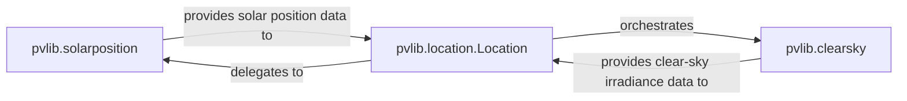

## Details

The `Environmental Conditions & Solar Geometry` subsystem is a critical part of `pvlib-python`, focusing on calculating fundamental environmental parameters for photovoltaic (PV) modeling.

### pvlib.solarposition
This component serves as the core computational engine for precise astronomical calculations. Its primary responsibility is to determine the solar position (zenith and azimuth angles) at a given time and location, along with related parameters such as Earth-Sun distance, equation of time, declination, and sunrise/sunset/transit times. It embodies the scientific algorithms for solar geometry.

**Related Classes/Methods**:

- <a href="https://github.com/pvlib/pvlib-python/blob/main/pvlib/solarposition.py" target="_blank" rel="noopener noreferrer">`pvlib.solarposition`</a>

### pvlib.clearsky
This component implements various atmospheric and radiative transfer models. Its main responsibilities include estimating solar radiation under ideal clear-sky conditions and providing methods to detect clear-sky periods from measured irradiance data. It encapsulates the models necessary for baseline irradiance calculations.

**Related Classes/Methods**:

- <a href="https://github.com/pvlib/pvlib-python/blob/main/pvlib/clearsky.py" target="_blank" rel="noopener noreferrer">`pvlib.clearsky`</a>

### pvlib.location.Location
This component acts as a high-level facade and orchestrator, encapsulating the geographical and temporal context (latitude, longitude, altitude, timezone) of a PV system. Its responsibility is to provide site-specific environmental data by delegating to and orchestrating calls to the `pvlib.solarposition` and `pvlib.clearsky` components. It simplifies the user interface for common environmental calculations.

**Related Classes/Methods**:

- <a href="https://github.com/pvlib/pvlib-python/blob/main/pvlib/location.py#L19-L409" target="_blank" rel="noopener noreferrer">`pvlib.location.Location`:19-409</a>

### [FAQ](https://github.com/CodeBoarding/GeneratedOnBoardings/tree/main?tab=readme-ov-file#faq)