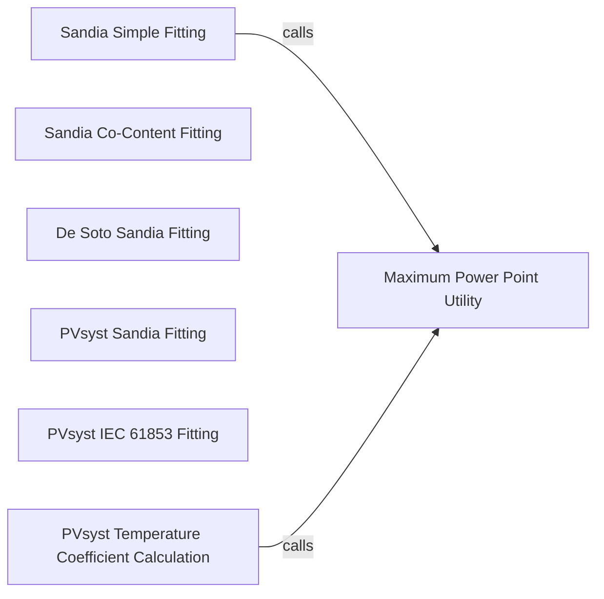

## Details

The `pvlib.ivtools` subsystem is primarily concerned with the analysis and fitting of Current-Voltage (IV) curve data for photovoltaic (PV) modules. It provides several specialized components for fitting single diode model (SDM) parameters using different methodologies, including Sandia, De Soto, and PVsyst approaches. A core utility, `Maximum Power Point Utility`, is leveraged across these fitting methods to identify the maximum power point from IV curves, which is crucial for accurate module characterization. The subsystem also includes a dedicated component for calculating PVsyst-specific temperature coefficients, essential for modeling PV module behavior under varying thermal conditions. This structured approach allows for flexible and accurate PV module performance analysis.

### Sandia Simple Fitting
Orchestrates the simplified Sandia single diode equation parameter fitting process. It provides a straightforward method for deriving SDM parameters from IV curve data.

**Related Classes/Methods**:

- <a href="https://github.com/pvlib/pvlib-python/blob/main/pvlib/ivtools/sde.py#L13-L165" target="_blank" rel="noopener noreferrer">`pvlib.ivtools.sde.fit_sandia_simple`:13-165</a>

### Sandia Co-Content Fitting
Implements an alternative method for fitting Sandia parameters based on the co-content principle, offering a different numerical approach to the fitting problem.

**Related Classes/Methods**:

- <a href="https://github.com/pvlib/pvlib-python/blob/main/pvlib/ivtools/sde.py#L260-L367" target="_blank" rel="noopener noreferrer">`pvlib.ivtools.sde._fit_sandia_cocontent`:260-367</a>

### De Soto Sandia Fitting
Fits single diode model parameters using the De Soto method, specifically tailored for inputs compatible with Sandia models. This component integrates a well-known SDM fitting approach.

**Related Classes/Methods**:

- <a href="https://github.com/pvlib/pvlib-python/blob/main/pvlib/ivtools/sdm/desoto.py#L220-L385" target="_blank" rel="noopener noreferrer">`pvlib.ivtools.sdm.desoto.fit_desoto_sandia`:220-385</a>

### PVsyst Sandia Fitting
Fits single diode model parameters using the PVsyst method, a widely recognized approach in the PV industry for module characterization.

**Related Classes/Methods**:

- <a href="https://github.com/pvlib/pvlib-python/blob/main/pvlib/ivtools/sdm/pvsyst.py#L24-L202" target="_blank" rel="noopener noreferrer">`pvlib.ivtools.sdm.pvsyst.fit_pvsyst_sandia`:24-202</a>

### PVsyst IEC 61853 Fitting
A specialized and comprehensive PVsyst fitting function designed for the IEC 61853 standard. It acts as an orchestrator, coordinating multiple sub-fittings to meet the standard's requirements.

**Related Classes/Methods**:

- <a href="https://github.com/pvlib/pvlib-python/blob/main/pvlib/ivtools/sdm/pvsyst.py#L313-L483" target="_blank" rel="noopener noreferrer">`pvlib.ivtools.sdm.pvsyst.fit_pvsyst_iec61853_sandia_2025`:313-483</a>

### Maximum Power Point Utility
A fundamental utility function used across various fitting methods to determine the maximum power point (P_mp) from an IV curve, which is a critical parameter for PV module performance.

**Related Classes/Methods**:

- <a href="https://github.com/pvlib/pvlib-python/blob/main/pvlib/ivtools/utils.py#L13-L30" target="_blank" rel="noopener noreferrer">`pvlib.ivtools.util.maxp`:13-30</a>

### PVsyst Temperature Coefficient Calculation
Calculates temperature coefficients specifically relevant to the PVsyst model, which are essential for accurately modeling module behavior under varying thermal conditions.

**Related Classes/Methods**:

- <a href="https://github.com/pvlib/pvlib-python/blob/main/pvlib/ivtools/sdm/pvsyst.py#L224-L310" target="_blank" rel="noopener noreferrer">`pvlib.ivtools.sdm.pvsyst.pvsyst_temperature_coeff`:224-310</a>

### [FAQ](https://github.com/CodeBoarding/GeneratedOnBoardings/tree/main?tab=readme-ov-file#faq)