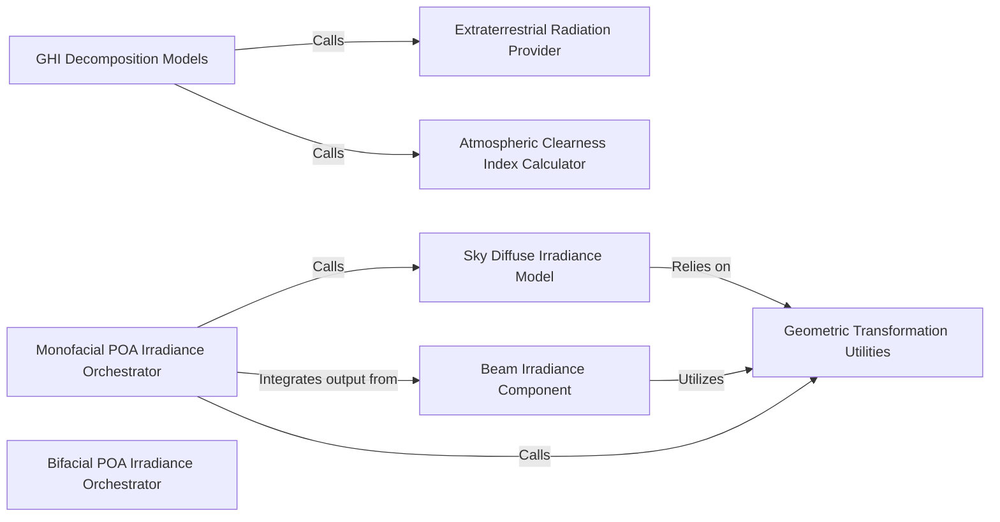

## Details

The `Irradiance Modeling` subsystem is a core part of `pvlib-python`, responsible for transforming global horizontal irradiance (GHI) into its direct, diffuse, and ground-reflected components on a tilted plane (Plane of Array - POA), including specialized models for bifacial PV systems.

### GHI Decomposition Models
This component encapsulates various algorithms (e.g., DISC, DIRINT, Erbs-Driesse) for decomposing Global Horizontal Irradiance (GHI) into its direct normal (DNI) and diffuse horizontal (DHI) components. These models are crucial initial data transformations in the irradiance modeling pipeline.

**Related Classes/Methods**:

- <a href="https://github.com/pvlib/pvlib-python/blob/main/pvlib/irradiance.py#L1778-L1879" target="_blank" rel="noopener noreferrer">`pvlib.irradiance.disc`:1778-1879</a>
- <a href="https://github.com/pvlib/pvlib-python/blob/main/pvlib/irradiance.py#L1928-L2020" target="_blank" rel="noopener noreferrer">`pvlib.irradiance.dirint`:1928-2020</a>
- <a href="https://github.com/pvlib/pvlib-python/blob/main/pvlib/irradiance.py#L2721-L2851" target="_blank" rel="noopener noreferrer">`pvlib.irradiance.erbs_driesse`:2721-2851</a>

### Monofacial POA Irradiance Orchestrator
Serves as the primary facade and orchestration point for calculating the total irradiance on a tilted plane (POA) for monofacial PV systems. It integrates outputs from various sub-components (direct, sky diffuse, ground diffuse).

**Related Classes/Methods**:

- <a href="https://github.com/pvlib/pvlib-python/blob/main/pvlib/irradiance.py#L270-L351" target="_blank" rel="noopener noreferrer">`pvlib.irradiance.get_total_irradiance`:270-351</a>

### Bifacial POA Irradiance Orchestrator
The main entry point for calculating total irradiance on bifacial PV systems, specifically handling the complexities of both front and backside irradiance contributions. It acts as a specialized facade for bifacial-specific calculations.

**Related Classes/Methods**:

- <a href="https://github.com/pvlib/pvlib-python/blob/main/pvlib/bifacial/infinite_sheds.py#L376-L578" target="_blank" rel="noopener noreferrer">`pvlib.bifacial.infinite_sheds.get_irradiance`:376-578</a>
- <a href="https://github.com/pvlib/pvlib-python/blob/main/pvlib/bifacial/infinite_sheds.py#L184-L373" target="_blank" rel="noopener noreferrer">`pvlib.bifacial.infinite_sheds.get_irradiance_poa`:184-373</a>

### Sky Diffuse Irradiance Model
Calculates the sky diffuse irradiance component on a tilted plane using various underlying models (e.g., isotropic, Perez, Hay-Davies). This is a critical sub-calculation for total POA irradiance.

**Related Classes/Methods**:

- <a href="https://github.com/pvlib/pvlib-python/blob/main/pvlib/irradiance.py#L354-L458" target="_blank" rel="noopener noreferrer">`pvlib.irradiance.get_sky_diffuse`:354-458</a>

### Geometric Transformation Utilities
Provides fundamental geometric calculations, including angle of incidence (AOI) and projection transformations, which are prerequisites for accurately determining direct and diffuse irradiance components on tilted surfaces.

**Related Classes/Methods**:

- <a href="https://github.com/pvlib/pvlib-python/blob/main/pvlib/irradiance.py" target="_blank" rel="noopener noreferrer">`pvlib.irradiance.aoi`</a>
- <a href="https://github.com/pvlib/pvlib-python/blob/main/pvlib/irradiance.py#L161-L201" target="_blank" rel="noopener noreferrer">`pvlib.irradiance.aoi_projection`:161-201</a>

### Extraterrestrial Radiation Provider
Supplies extraterrestrial radiation data, which is a fundamental astronomical input for various irradiance models, especially those involving atmospheric decomposition and clear-sky calculations.

**Related Classes/Methods**:

- <a href="https://github.com/pvlib/pvlib-python/blob/main/pvlib/irradiance.py#L33-L122" target="_blank" rel="noopener noreferrer">`pvlib.irradiance.get_extra_radiation`:33-122</a>

### Atmospheric Clearness Index Calculator
Computes the atmospheric clearness index, a dimensionless quantity used in various GHI decomposition models to characterize atmospheric conditions and their impact on solar radiation.

**Related Classes/Methods**:

- <a href="https://github.com/pvlib/pvlib-python/blob/main/pvlib/irradiance.py" target="_blank" rel="noopener noreferrer">`pvlib.irradiance.clearness_index`</a>

### Beam Irradiance Component
Calculates the direct (beam) irradiance component on a tilted surface, considering the angle of incidence and the direct normal irradiance. This is a primary input to the total POA irradiance.

**Related Classes/Methods**:

- <a href="https://github.com/pvlib/pvlib-python/blob/main/pvlib/irradiance.py#L240-L267" target="_blank" rel="noopener noreferrer">`pvlib.irradiance.beam_component`:240-267</a>

### [FAQ](https://github.com/CodeBoarding/GeneratedOnBoardings/tree/main?tab=readme-ov-file#faq)